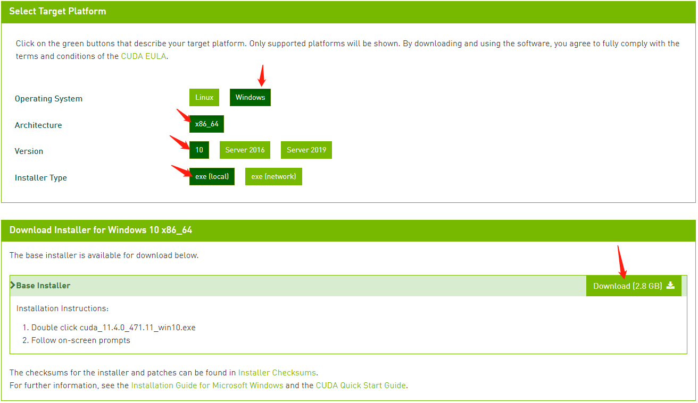

## 1-1 【CUDA + Anaconda】机器学习环境搭建

### 动手学AI系列特点

1. **简单好上手**帮你省时间
2. 介绍最新**最前沿**的算法
3. 有效解决你的**实战问题**

### 本节目标

**安装CUDA和Anaconda** 把开发环境搭建起来

### CUDA是什么？

CUDA是底层的显卡驱动，它用来管理GPU，实现并行运算.
由于是英伟达公司推出的平台，所以电脑的显卡必须是Nvidia的
AMD的不行，装不了CUDA

这里注意:不要随意下载版本安装，我们要根据电脑显卡驱动的版本.
安装对应支持的CUDA版本，否则会有不兼容的情况

### 查看电脑显卡型号是否支持CUDA的安装
[查看电脑显卡型号是否支持CUDA的安装](https://developer.nvidia.com/zh-cn/cuda-gpus)

可以在上面的网页中查到

### 查看电脑显卡的驱动版本

查看的方法是：
在电脑桌面
单击鼠标右键
然后选择【NVIDIA控制面板】
在面板里点击【系统信息】查看
就能看到驱动程序版本信息了
可以看到我的显卡驱动版本是472.12

### 根据显卡驱动版本下载支持的CUDA版本
[到英伟达的CUDA版本信息中查看](https://docs.nvidia.com/cuda/cuda-toolkit-release-notes/index.html)

由于我的驱动版本是472 .12
所以我最高能安装的CUDA版本就是11.4.0

[打开CUDA安装地址下载对应的CUDA版本](https://developer.nvidia.com/cuda-toolkit-archive)

点击进入到下载页面

选择对应的选项后
点击下载
双击下载的exe文件进行安装
一路下一步，无脑安装。
默认安装在C:\Program Files\NVIDIA GPU Computing Toolkit\CUDA
当然如果你想自定义的话要记住你选择的安装路径。
到此
第一步的CUDA安装就完成了

### 检查CUDA是否安装成功

我们打开cmd 
在命令行中输入 nvcc -V
然后回车
成功的话就会返回CUDA的版本号了

### 安装Anaconda
Anaconda是Python的包管理器和环境管理器

[官网下载地址](https://www.anaconda.com/products/individual)
根据自己的电脑情况 
选择对应的版本下载
下载后的exe文件直接鼠标双击安装
一路下一步

安装完成后需要配置环境变量
在path中添加安装Anaconda的根目录以及Scripts目录

配置好后在cmd中运行
conda -V
查看版本信息
conda  env list
查看我们的虚拟环境

### 更换Anaconda的安装包下载源

打开[清华镜像网站](https://mirrors.tuna.tsinghua.edu.cn/help/anaconda/)
因为conda默认使用的是国外的下载地址
常常导致下载一些包的时候非常慢

可以按照下面操作进行：

先在用户目录下查看是否有.condarc文件
没有的话
在cmd命令行中先执行
conda config --set show_channel_urls yes
就会生成.condarc文件了
然后再进行修改。
修改后
执行 conda clean -i 
清除索引缓存
保证用的是镜像站提供的索引。

到此开发环境就已经搭建完成。

