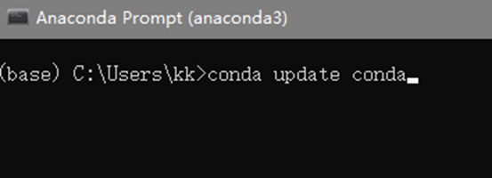

## 1-2 conda的使用

### 本节目标   conda的常用命令
整理的一些常用命令：
1. conda --version #查看conda版本，验证是否安装
2. conda update conda #更新至最新版本，也会更新其它相关包
3. conda update --all #更新所有包
4. conda update package_name #更新指定的包
5. conda create -n env_name package_name #创建名为env_name的新环境，并在该环境下安装名为package_name 的包，可以指定新环境的版本号，例如：conda create -n python3 python=python3.7 numpy pandas，创建了python3环境，python版本为3.7，同时还安装了numpy pandas包
6. conda activate env_name #切换至env_name环境
7. conda deactivate #退出环境
8. conda info -e #显示所有已经创建的环境  或者使用 conda env list
9. conda create --name new_env_name --clone old_env_name #复制old_env_name为new_env_name
10. conda remove --name env_name –all #删除环境
11. conda list #查看所有已经安装的包
12. conda install package_name #在当前环境中安装包
13. conda install --name env_name package_name #在指定环境中安装包
14. conda remove -- name env_name package #删除指定环境中的包
15. conda remove package #删除当前环境中的包
16. conda env remove -n env_name #采用第10条的方法删除环境失败时，可采用这种方法

### 为什么学习conda

conda 的一个最大的优势就是
可以构建多个python虚拟环境，他们彼此隔绝
互不干扰，当需要用到哪个环境时就切换到此
举个栗子：你正在python3.7的环境下做开发
这时接到一个新活需要用到python2.7版本
这时你就可以使用conda新建一个python2.7的环境
切换到此，来完成新任务，不会影响到原来的项目

conda的另一大优势：
他可以帮我们安装不同版本的包及其依赖
你再也不用为依赖关系而烦恼

### 1. Anaconda 图形化界面介绍

上节我们安装了Anaconda这个软件
不知道你有没有注意到
桌面上并没有生成它的图标
那么到哪里去找到它呢？

它在这个地方：
可以看到有Anaconda Navigator
Anaconda Prompt
还有后续会讲到的Jupyter Notebook

我们先点击Anaconda Navigator 启动
看一下图形化界面

可以看到home页面，
已经帮我们安装好了一些工具软件
有Jupyter Notebook 
点击lanuch按钮就能启动了

切换到Environments界面

可以看到base是默认的虚拟环境
右侧是已经在base环境下默认安装好的包
在此你可以做一些添加、更新、删除包的操作

下面的create按钮用来新建一个新的虚拟环境
Clone按钮用来克隆当前环境
Import按钮 用来导入外部的环境
Remove按钮当然就是用来删除的了

### 2. conda的命令行操作

点击Anaconda Prompt打开命令行

可以看到前面的（base）
这是默认的虚拟环境
base是它的名字

接下来我们来学习日常开发中
会用到的一些conda命令

conda -V
查看conda的版本

如果想更新conda的版本使用：
conda  update conda 

update关键字就是表示用来更新包
后面的conda 就是你需要更新的包的名字

查看配置了多少虚拟环境使用：
conda env list 

可以看到这里除了默认环境base
我还创建了一个叫做kk的环境

注意：Base环境这里有个*号  代表当前是处在这个环境下

创建环境的命令是：
conda create -n GengZhi  python

create 关键字 代表是创建   

-n  n是name的缩写 -n后面是自己给新环境取得名字

这里我就叫GengZhi
建议大家取和项目相关辨识度高的名字

名字后面的python 就代表Python的环境
也可以指定具体的Python版本 像这样写： Python=3.7

这里我没有指定版本conda就会帮我们下载最新的python解释器
创建好的新虚拟环境所在的位置是在
电脑Anaconda安装位置下的envs目录下

我们使用命令
conda activate GengZhi 切换到此环境下

可以看到命令前的括号里的gengzhi
就说明我们切换到此环境了

activate 关键字后跟的就是你要切换到的环境名

如果想退出当前环境使用
conda deactivate  即可

我们在gengzhi这个环境下使用
conda list 命令
列出此环境下已安装的包

可以看到conda 除了帮我们安装了python3.10
还帮我们装了其他一些包

这就是conda的另一大优势：
他可以帮我们安装不同版本的包及其依赖
你再也不用为依赖关系而烦恼

我们来使用conda安装numpy

conda install numpy

conda就会从远程搜索numpy相关信息和依赖项目
Install关键字代表 安装
后面跟 你需要安装的包的名字

可以指定具体的版本
不指定的话conda就会帮我们安装最新的版本

如果你不确定要安装的包有哪些版本
可以使用指令
conda  search numpy   来查看

search关键字代表搜索
后面跟 你需要搜索的包的名字

删除包的指令：

conda uninstall numpy 或者 conda remove numpy

就会帮我们将numpy包及其有依赖关系的包给删除

假设想删除我们刚创建的gengzhi环境

这里注意：首先我们需要先退出gengzhi环境
使用 conda deactivate 命令

然后在执行：
conda remove -n GengZhi --all
conda就会帮我们把gengzhi这个环境包含里面已经安装的包都给删除

好，到此，关于conda 的日常开发
经常使用到的命令就介绍到这了
希望小伙伴们能多动手实践
纸上得来终觉浅 绝知此事要躬行 啊

