1-3 Jupyter Notebook 快速上手
-----------------------------

Jupyter是什么
~~~~~~~~~~~~~

Jupyter
Notebook是一个开源的Web应用程序，允许开发者方便的创建和共享代码文档

可以实时的编写代码块运行代码块，查看结果并可视化数据

Jupyter Notebook特点
~~~~~~~~~~~~~~~~~~~~

-  支持markdown语法
-  支持LaTeX公式 eg:积分 :math:`\int_0^1 {x^2} \,{\rm d}x`
-  允许把代码写入到独立的cell中，然后单独执行，无需从头开始执行代码

教程结构
~~~~~~~~

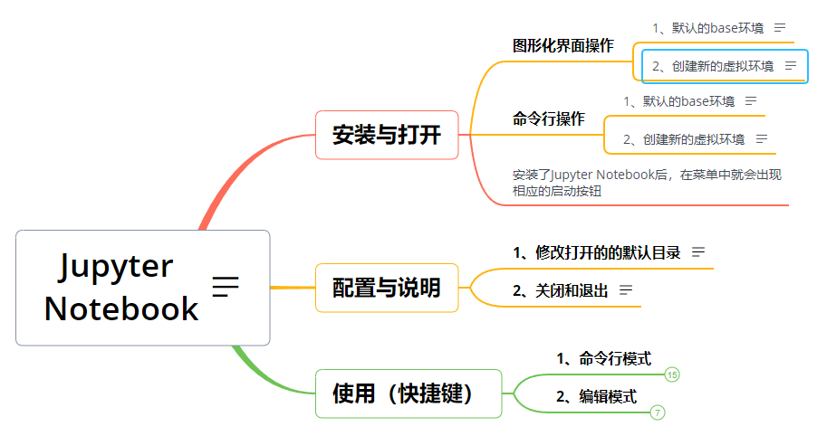

1. Jupyter的安装与运行
~~~~~~~~~~~~~~~~~~~~~~

1.1 图形化界面操作
^^^^^^^^^^^^^^^^^^

1.1.1 默认的base环境
''''''''''''''''''''

安装了Anaconda后，在base环境就默认就安装了Jupyter Notebook

打开Anaconda，在home界面直接点击launch运行

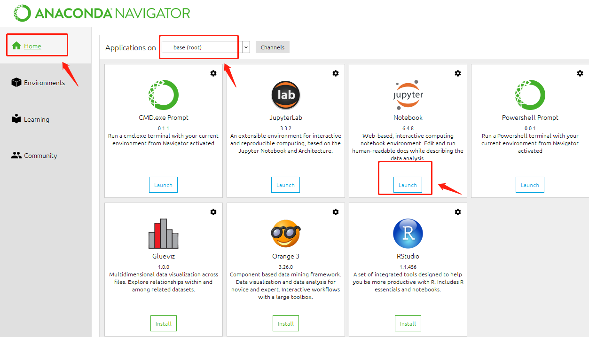

1.1.2 创建新的虚拟环境
''''''''''''''''''''''

打开Anaconda,在Environments界面，创建新的python虚拟环境

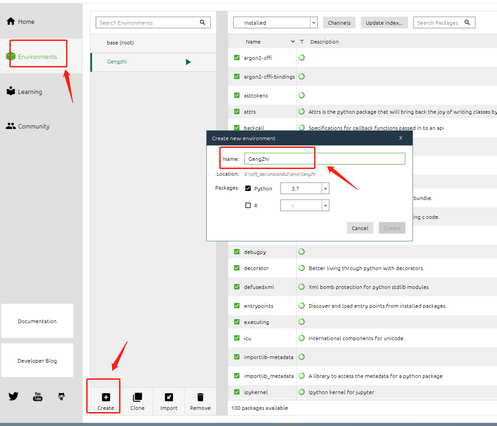

然后回到home界面，点击install按钮安装Jupyter Notebook
安装完成后点击launch按钮运行

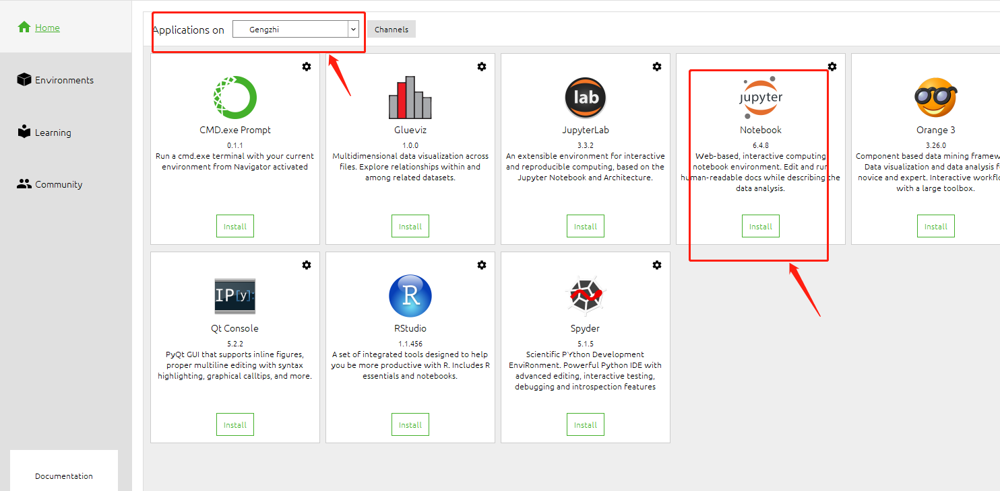

1.2 命令行操作
^^^^^^^^^^^^^^

.. _默认的base环境-1:

1.2.1 默认的base环境
''''''''''''''''''''

打开Anaconda Prompt命令行：

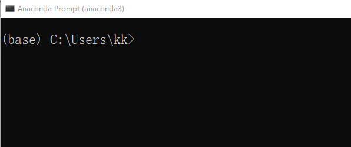

因为base环境默认已经安装了Jupyter Notebook 所有直接输入命令： jupyter
notebook 运行

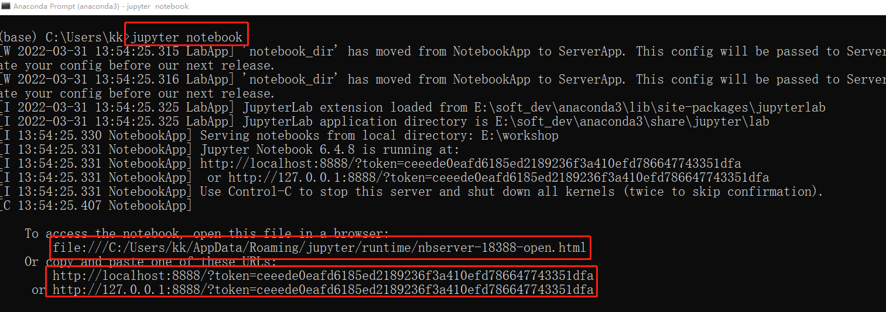

可以看到浏览器中就打开了Jupyter 如果你的浏览器没有打开Jupyter的话，
你可以将命令行中下面的这几个链接复制到浏览器中应该就能打开了
这里注意：命令行窗口不要关闭， 关闭窗口的话，服务就关闭了，
你就无法在jupyter中进行其他操作了

.. _创建新的虚拟环境-1:

1.2.2 创建新的虚拟环境
''''''''''''''''''''''

如果你不想在base环境中运行Jupyter的话 我们现在命令行窗口中
连按两次Ctrl+c 关掉kernel与服务

然后创建一个新的虚拟环境Gengzhige 大家应该没有忘记上节课讲的conda命令吧
conda create -n Gengzhige python 接着切换到Gengzhige这个虚拟环境中 conda
activate Gengzhige

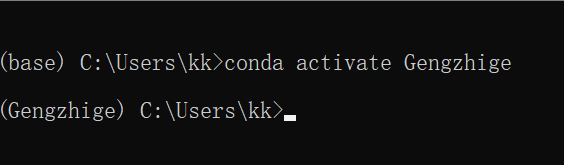

新创建的Gengzhige环境 并不会默认安装Jupyter 我们使用install命令来安装
conda install jupyter notebook

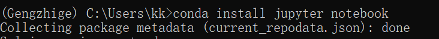

等待一会 安装完成后，我们输入 jupyter notebook 回车
就可以看到浏览器中打开了Jupyter

2. 配置与说明
~~~~~~~~~~~~~

2.1 修改打开的默认目录
^^^^^^^^^^^^^^^^^^^^^^

2.1.1 方式一
''''''''''''

其实jupyter默认是定位到的是\ ``C:\Users\xxx``\ 这个路径下的目录

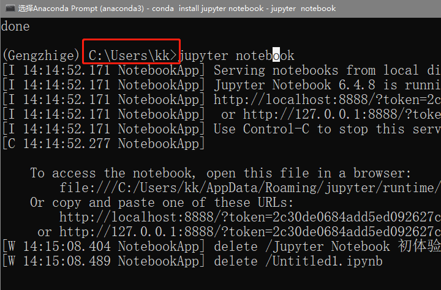

比如我在E盘上有一个\ ``workshop``\ 文件夹,我想让jupyter打开的是个目录怎么操作呢？

在命令行中切换到\ ``E:\workshop``\ 这个目录下

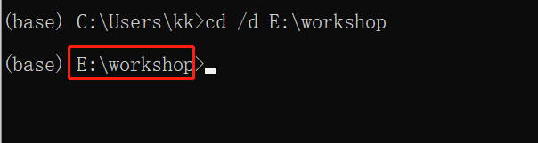

（切换目录这里：

可以直接使用\ ``cd  /d  具体的目录``\ 一步切换

也可以先使用\ ``E:``\ 切换到某个盘符下
在使用\ ``cd 目录``\ 切换到目标目录）

然后在workshop这个目录下输入：jupyter notebook 回车

可以看到现在jupyter显示的就是workshop这个目录了

2.1.2 方式二
''''''''''''

在命令行中输入： jupyter notebook –generate-config

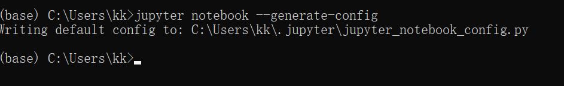

可以看到在此目录下\ ``C:\Users\kk\.jupyter``\ 有一个配置文件jupyter_notebook_config.py

找个这个文件并打开使用ctrl+f 搜索\ ``NotebookApp.notebook_dir``

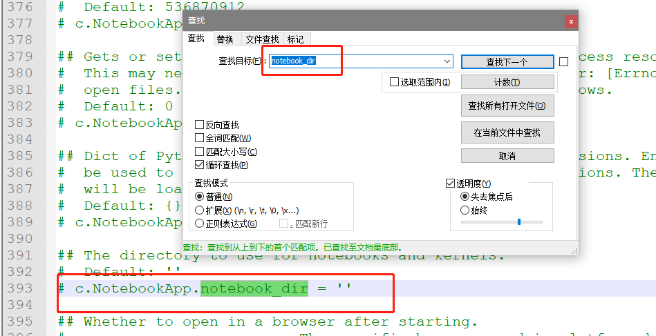

找到之后将想默认打开的目录路径这个路径 粘贴在此 例如：\ ``E:\workshop``

**注意：需要这行将前面的# 注释去掉**

然后保存关闭此文件

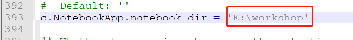

2.2 关闭和退出
^^^^^^^^^^^^^^

使用命令行运行jupyter Notebook后

在使用期间 命令行窗口不要关闭否则服务就会关闭

使用完毕后，连按两次\ **[Ctrl+C]** 关闭服务

3. 使用快捷键
~~~~~~~~~~~~~

**按【H】键，会调出键盘快捷键**

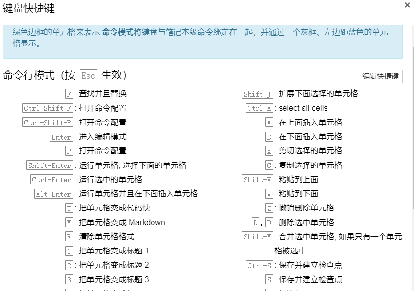

3.1 命令行模式
^^^^^^^^^^^^^^

**Esc键 进入命令行模式**

**单元格左边变蓝色**

常用快捷键

【Ctrl+Enter】：是运行选中的单元格，他会停留在此

【Alt+Enter】：是运行单元格并且在下面插入一个新的单元格

【Shift+Enter】:是 运行单元格, 并选择下面的单元格

【Tab】键用来代码补全

【A】键：above是在上面插入单元格

【B】键：below 是在下面插入单元格

【M】键： 是把单元格变成Markdown

【Y】键：是把单元格变成代码块

两下【D】键：删除选中的单元格

3.2 编辑模式
^^^^^^^^^^^^

**Enter键 进入编辑模式**

常用快捷键

【Ctrl+/】:代码注释

【Ctrl+D】:删除整行

4. 常用Markdown语法
~~~~~~~~~~~~~~~~~~~

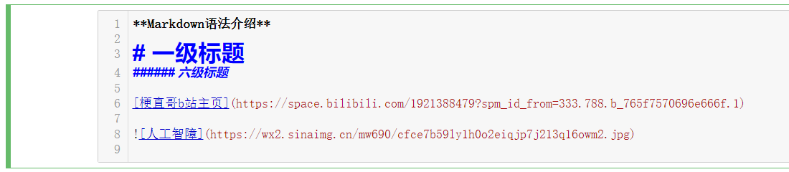

粗体：使用 **粗体显示的文字** 例如： **markdown语法介绍**

使用#号代表1-6级标题 1个#号代表最大的1级标题，以此类推 6个#号
代表最小的6级标题

插入链接： 例如：
`梗直哥b站首页 <https://space.bilibili.com/1921388479/dynamic?spm_id_from=333.999.0.0>`__

插入图片：

5. LaTeX示例
~~~~~~~~~~~~

Jupyter还支持LaTeX

注意此时单元格要切换成markdown格式

在单元格中输入：\ :math:`a^2+b^2=c^2`

左右的$ 代表这是行内公式

如果左右各输入两个$$

则代表是独立公式

【Ctrl+Enter】执行此单元格看效果
