## 1-4 matplotlib快速上手


### 为什么学习matplotlib
能够将数据进行**可视化**， 更直观的展示
为后续的决策提供数据支持

### matplotlib是什么
最流行的Python绘图库，主要**做数据可视化图表**， 名字来源于MATLAB

### 学习案例  教程资源
**[matplotlib 教程](https://www.cainiaojc.com/matplotlib/)**

**[matplotlib案例教程](https://matplotlib.org/stable/gallery/index)**

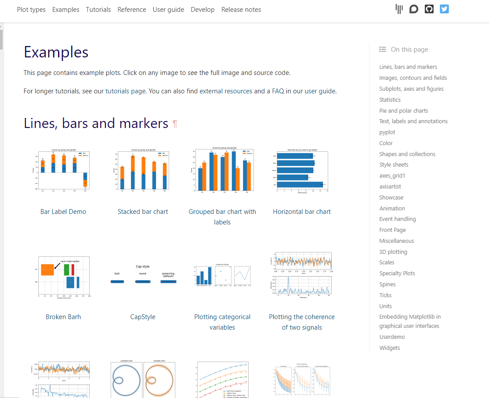

每个案例点进去，可以看到源代码

建议多动手实践

### 安装 matplotlib

首先打开 Anaconda Prompt

切换到对应的虚拟环境中

使用命令安装：
**conda install matplotlib**


关于**conda**的使用 不了解的可以看前期教程

### matplotlib基本语法


```python
# 导入pyplot模块
# as 取别名  约定俗成plt
from matplotlib import pyplot as plt
# 数据在x轴的位置 
x = range(2, 26, 2)
# 数据在y轴的位置
y = [11, 23, 11.3, 35, 45, 65, 35, 27, 76, 8, 11, 45]
# 传入x y 通过plot绘制出折线图
plt.plot(x, y)
# 展示图表
plt.show()
```


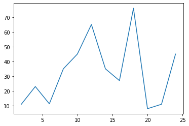


### 支持的绘制(图表)类型

| 编号 | 函数      | 描述                  |
| :--- | :--------: | :-------------------- |
| 1    | Bar       | 绘制条形图(柱状图)。  |
| 2    | Barh      | 绘制水平条形图。      |
| 3    | Boxplot   | 绘制一个箱形和须图。  |
| 4    | Hist      | 绘制直方图。          |
| 5    | hist2d    | 绘作2D直方图。        |
| 6    | Pie       | 绘制饼图。            |
| 7    | Plot      | 绘制轴的线和/或标记。 |
| 8    | Polar     | 绘制一个极坐标图。    |
| 9    | Scatter   | 绘制x与y的散点图。    |
| 10   | Stackplot | 绘制堆积区域图。      |
| 11   | Stem      | 绘制杆图              |
| 12   | Step      | 绘制步骤图。          |
| 13   | Quiver    | 绘制二维箭头字段。    |

### 更多用法

1. 设置图片大小 
2. 设置图片清晰度
2. 保存到本地
3. 设置描述信息（x轴y轴表示什么，这个图表示什么）
4. 调整x轴或者y轴的刻度的间距
4. 绘制网格
5. 线条宽度 线条样式 颜色 透明度
6. 标记出特殊的点（比如最高点 最低点）
7. 给图片添加一个水印（防伪防盗）
7. 等等


####  设置图片大小、清晰度  保存到本地


```python
from matplotlib import pyplot as plt
# figure图形图标的意思，在这里指的就是我们要画的图
# 通过实例化一个figure并且传递参数，能够在后台自动使用该figure实例
# figsize 用来设置图像大小
# 在图像模糊的时候 可以传入dpi参数来让图片更加清晰
fig = plt.figure(figsize=(10, 5), dpi=100)
x = range(2, 26, 2)
y = [11, 23, 11.3, 35, 45, 65, 35, 27, 76, 8, 11, 45]
plt.plot(x, y)
# savefig 保存图片
# 参数为 图像名称以及格式
# 可以保存为svg矢量图格式，放大不会有锯齿
# plt.savefig("gengzhi.svg")
plt.show()
```


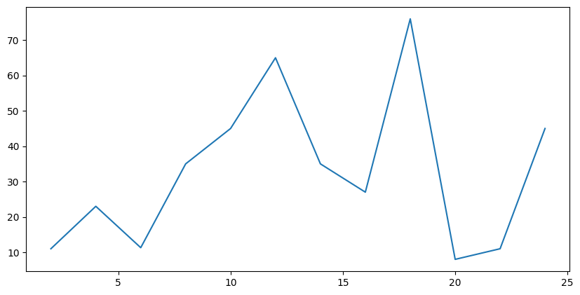


#### 设置x轴y轴刻度


```python
from matplotlib import pyplot as plt
x = range(2, 26, 2)
y = [11, 23, 11.3, 35, 45, 65, 35, 27, 76, 8, 11, 45]
plt.plot(x, y)
# 设置x轴的刻度
plt.xticks(x)
# 设置y轴的刻度
plt.yticks(range(min(y), max(y)+1)[::5])
plt.show()
```


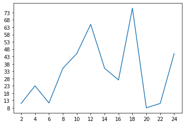


#### 调整刻度


```python
from matplotlib import pyplot as plt
import random
x = range(0, 60)
y = [random.randint(10, 40) for i in range(60)]
plt.plot(x, y)
# 调整x轴刻度
_x = x[::5]
_xtick_labels = ["{}分钟".format(i) for i in _x]
# plt.xticks(_x, _xtick_labels)
# rotation 刻度旋转
plt.xticks(_x, _xtick_labels, rotation=50, fontproperties="STSong")
plt.show()
```


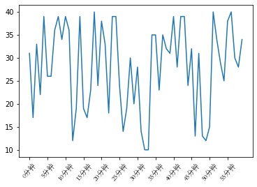


#### 设置中文显示
matplotlib默认不支持中文字符


```python
from matplotlib import pyplot as plt
import random
# 设置字体 matplotlib.rc
import matplotlib
font = {"family":"MicroSoft YaHei",
       "weight":"bold",
       "size":"12"}
matplotlib.rc("font", **font)
# matplotlib.rc("font", family="MicroSoft YaHei")

x = range(0, 60)
y = [random.randint(10, 40) for i in range(60)]
plt.plot(x, y)
_x = x[::5]
_xtick_labels = ["{}分钟".format(i) for i in _x]
plt.xticks(_x, _xtick_labels, rotation=50)
plt.show()
```


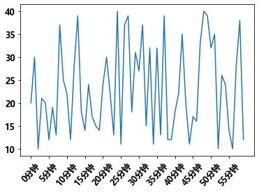


### 设置描述信息


```python
from matplotlib import pyplot as plt
import random
# 设置字体
import matplotlib
font = {"family":"MicroSoft YaHei",
       "weight":"bold",
       "size":"12"}
matplotlib.rc("font", **font)

x = range(0, 60)
y = [random.randint(10, 40) for i in range(60)]

plt.plot(x, y)
_x = x[::5]
_xtick_labels = ["{}分钟".format(i) for i in _x]
plt.xticks(_x, _xtick_labels, rotation=50)
# 添加x轴描述信息
plt.xlabel("时间")
# 设置y轴表述信息
plt.ylabel("温度")
# 设置标题
plt.title("每分钟气温变化图")
plt.show()

```


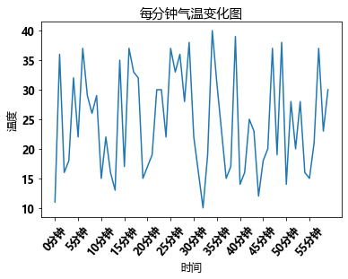


### 绘制网格


```python
from matplotlib import pyplot as plt
import random
import matplotlib
font = {"family":"MicroSoft YaHei",
       "weight":"bold",
       "size":"12"}
matplotlib.rc("font", **font)
x = range(0, 60)
y = [random.randint(10, 40) for i in range(60)]

plt.plot(x, y)
_x = x[::5]
_xtick_labels = ["{}分钟".format(i) for i in _x]
plt.xticks(_x, _xtick_labels, rotation=50)
plt.xlabel("时间")
plt.ylabel("温度")
plt.title("每分钟气温变化")
# 绘制网格
# plt.grid()
# alpha 设置透明度
plt.grid(alpha=0.4)
plt.show()
```


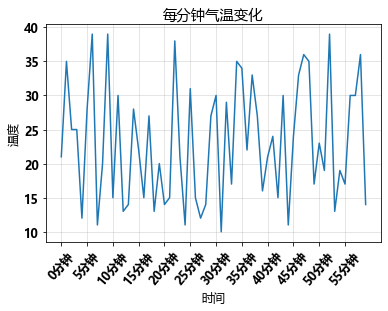


### 设置线条颜色 格式 粗细 透明度


```python
from matplotlib import pyplot as plt
import random
import matplotlib
font = {"family":"MicroSoft YaHei",
       "weight":"bold",
       "size":"12"}
matplotlib.rc("font", **font)
x = range(0, 60)
y = [random.randint(10, 40) for i in range(60)]
plt.plot(x, y,
        color="red",# 线条颜色
        linestyle="--",# 线条风格
        linewidth=2,# 线条粗细
        alpha=0.5 #透明度
        )
_x = x[::5]
_xtick_labels = ["{}min分钟".format(i) for i in _x]
plt.xticks(_x, _xtick_labels, rotation=50)
plt.xlabel("时间")
plt.ylabel("温度")
plt.title("每分钟气温变化")
plt.grid(alpha=0.4)
plt.show()

```


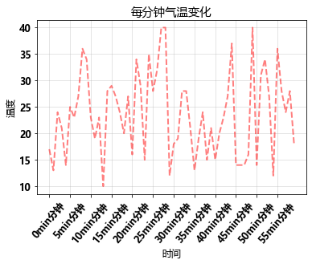


### 绘制散点图


```python
from matplotlib import pyplot as plt
import random
x = range(0, 60)
y = [random.randint(10, 40) for i in range(60)]
# 散点图
plt.scatter(x, y,)
plt.show()
```


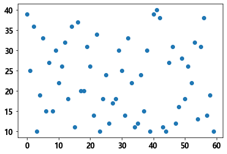


###  绘制条形图


```python
from matplotlib import pyplot as plt
import random
x = range(0, 60)
y = [random.randint(10, 40) for i in range(60)]
# 条形图
plt.bar(x, y,)
plt.show()
```


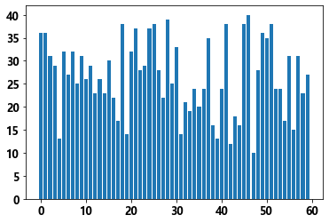


### 添加水印


```python
from matplotlib import pyplot as plt
import random
plt.rcParams['font.sans-serif'] = ['SimHei'] 
x = range(0, 60)
y = [random.randint(10, 40) for i in range(60)]
plt.scatter(x, y,)
#  设置文字水印
plt.text(30, 20, "梗直哥", size=30, rotation=20, alpha=0.4, color="red")
plt.show()
```


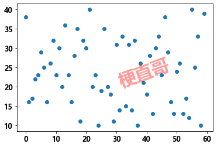

