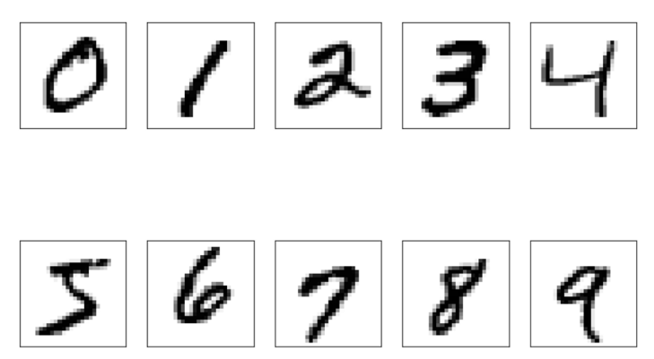
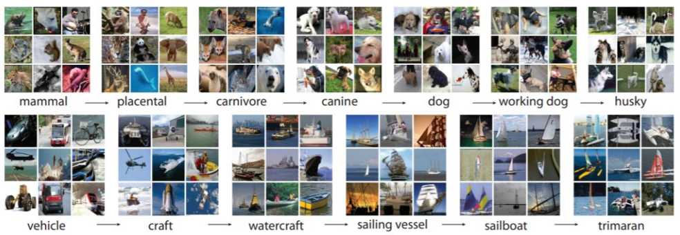
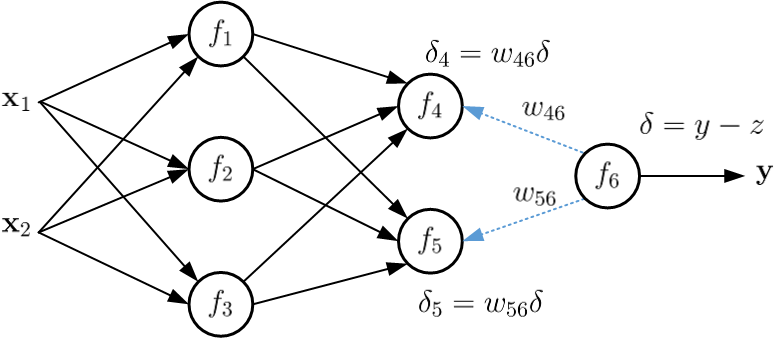
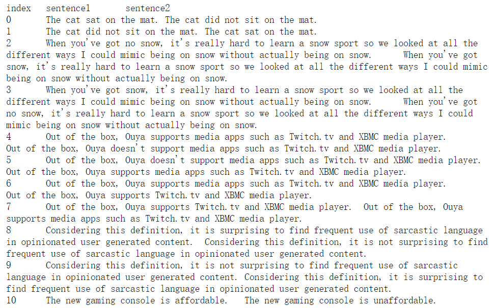
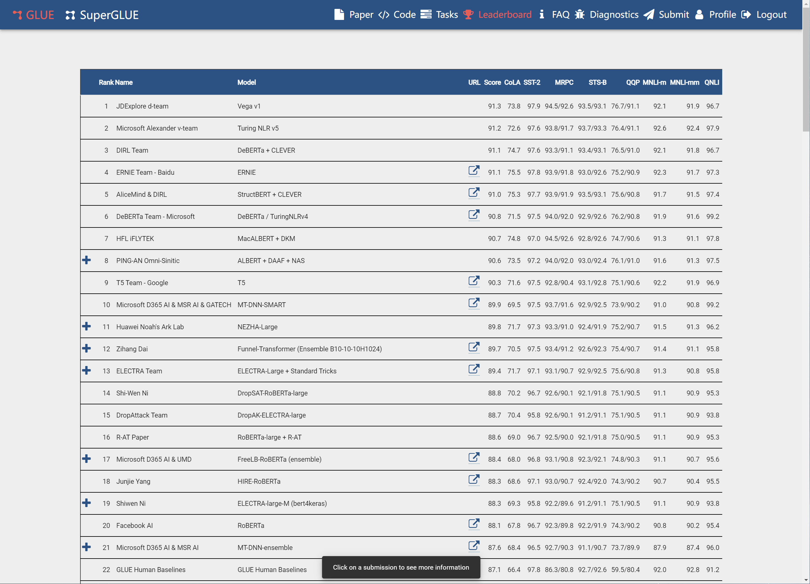
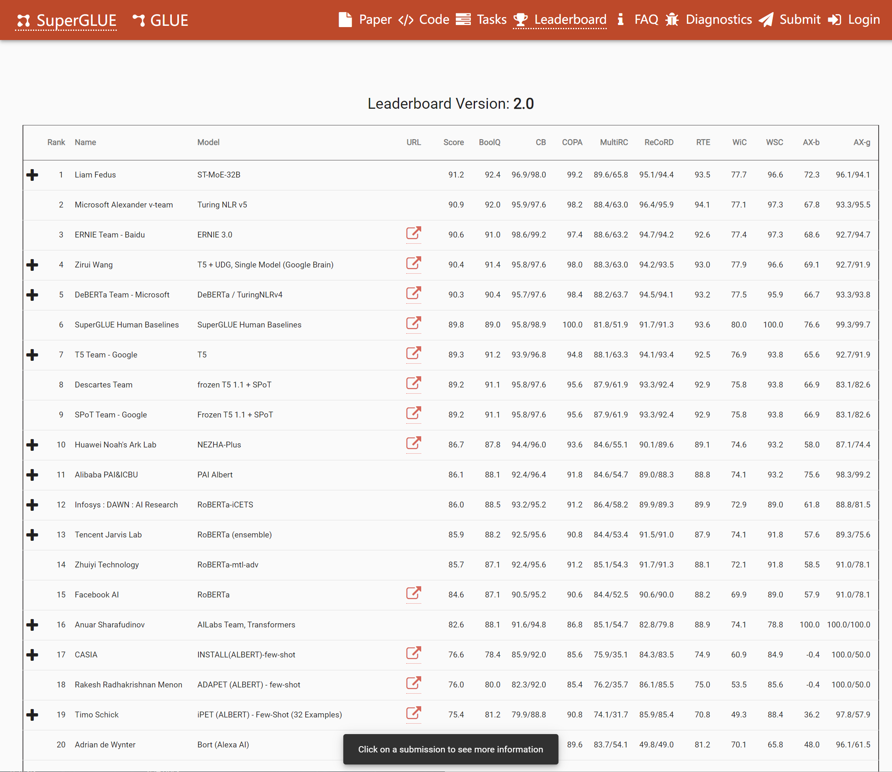

## 2-1 深度学习的数据处理（上）

如果说深度学习是一件制作精美的工艺品，那么算法是制作技巧，数据则是制作材料。在当前开源模型层出不穷的情形下，工匠的制作技巧大差不差，“工艺品”的价格则更多的取决于“制作材料”。

与传统机器学习算法不同，深度学习没有人工筛选特征这一操作，而是通过对数据的学习来自动提取特征。这就对数据集的规模和质量有了更高的需求。

一个机器学习团队，80%的工作应该放在数据准备上，这话也许有些言过其实，但道理还是对的。实际上，很多时候调优数据比调优模型更加重要。

那么数据集长啥样？我们需要多少数据？又该怎样调优呢？别着急我们一个一个来。

首先要搞明白数据集是什么，我们一起来看几个经典的数据集。

### 1. MNIST

这个手写体数字识别的数据集号称深度学习领域的hello world，在业内可谓家喻户晓。它早在1998年，就由Yann Lecun等专家设计构建出来了，近二十年一直是深度学习入门者最先接触的数据集。

官方下载地址如下：[MNIST](http://yann.lecun.com/exdb/mnist/)

但你不用去专门下载，因为很多框架中都可以直接导入它，比如Pytorch中，可以通过如下方法引入：


```python
import torch
import torchvision

from torchvision import datasets, transforms

transform = transforms.Compose([transforms.ToTensor(), transforms.Normalize(mean = (0.5), std = (0.5))])
train_dataset = torchvision.datasets.MNIST(root='./data', train = True, download = True, transform = transform)
test_dataset = torchvision.datasets.MNIST(root='./data', train = False, download = True, transform = transform)

batch_size = 64
train_loader = torch.utils.data.DataLoader(dataset = train_dataset,
                                           batch_size = batch_size,
                                           shuffle = True)
test_loader = torch.utils.data.DataLoader(dataset = test_dataset,
                                          batch_size = batch_size,
                                          shuffle = True)
```

运行上面的程序后，会自动将数据集下载到目录下的data文件夹。可以看到，MINST是由60000个训练集和10000个测试集组成。其中数据是28×28的矩阵，标签则是一个数字。标签好理解，就是0-9这10个数字，那数据长什么样呢？

我们可以通过如下代码把数据打印出来看看：


```python
import matplotlib.pyplot as plt

examples = enumerate(test_loader)
batch_idx, (example_data, example_targets) = next(examples)

plt.figure()
for i in range(6):
    plt.subplot(2, 3, i + 1)
    plt.tight_layout()
    plt.imshow(example_data[i][0], cmap='gray', interpolation='none')
    plt.title("Ground Truth: {}".format(example_targets[i]))
    plt.xticks([])
    plt.yticks([])
plt.show()
```

执行一下可以看到数据集里面的手写体数字是这样的。



那为什么要区分训练集和测试集呢？训练集是用来让模型学习的，测试集是用来检验模型效果的。就好像我们上学时，教科书里面的知识就是训练集，期末考试的试卷则是测试集。
有一点需要注意，这个例子中的考试非常严格，不会从教科书里面出“原题”来考。所以训练集和测试集是完全分离开来的。

这么严格是有原因的，模型训练的目的，是希望通过学习1+1=2, 2+2=4，让模型学会3+3=6，而不是学了半天，还是只会1+1=2。这种能力有个专属名词，叫做泛化性。泛化性强的模型，面对任何没见过输入，都能保证一定的准确性。泛化性弱的模型，只能解决训练集出现过的问题，不会举一反三，遇到新问题就傻眼了。

### 2. ImageNet

如果说MNIST是深度学习的敲门砖，那么ImageNet就是深度学习的登山梯。ImageNet是一个图像分类数据集，诞生于2009年，数据集源自李飞飞在著名的人工智能顶会CVPR2009上发表的一篇论文《ImageNet: A Large-Scale Hierarchical Image Database》，之后直到2017年，基于ImageNet数据集，每年都会举办算法比赛，各种改进模型层出不穷，极大促进了深度学习的发展。

这个数据集的数量级远非MNIST可比，完整的数据集有一千四百万张图像，分为两万多个类别，数据可以从网上下载，地址在：[ImageNet](http://www.image-net.org/)



对于初学者而言，如此庞大的数据集很难训练和使用，著名的机器学习平台Kaggle上，开放了ImageNet的子集，从两万多个类别中，筛选出了1000个类别，包含128万训练集，5万的验证集，以及10万的测试集。

看到这里，有的小伙伴可能会疑惑，我们刚刚讲完训练集和测试集，怎么这里又冒出来个验证集呢？

我们说划分训练集和测试集的目的是提升模型泛化性，实际上划分验证集的目的也是一样。我们先来聊聊没有验证集的情况。比如ImageNet的这个比赛，大家的模型训练出来以后，会在测试集上运行，然后计算出来一个得分，最终通过得分的高低评价模型的优劣。

因此所有的参赛者都会努力调优模型，让模型能得到一个更高的分数。因为测试集内容是固定的，所以慢慢的随着时间的推移，大家的模型都会更加倾向于拟合测试集。一些喜欢刷榜的参赛者，甚至会寻找到一些规律，然后在模型中增加人为的规则来提升分数。结果就是模型在测试集上表现惊艳，但真的实际应用，效果却一言难尽。这种缺乏泛化能力的情况，也被称为过拟合。就是过度拟合已知数据，只在特定数据集上效果显著，在未知的新数据上效果拉胯。此时就需要验证集出马了。

大家不是需要优化模型吗？那就在验证集上调优就好，最后再通过测试集这个照妖镜，分辨出哪个才是货真价实的好模型。

这种策略虽然在短期内有效解决了模型泛化性不足的问题，但在从业者的眼中，仍然没能彻底根治问题。就拿NLP领域最著名的一个排行榜，glue排行榜来说，自从BERT模型横空出世以来，两阶段预训练语言模型成为主流。

各种调优模型的方案层出不穷，包括有文化的语言模型ERNIE、向往GAN网络花式调整模型结构的Electra、排列组合玩的贼6的XLNET、穷人也能用得起的ALBERT、也有一力降十会的GPT3、T5等等。

这些模型在精彩激烈的打榜过程中是不是也在慢慢把测试集变成了验证集呢？

### 3. GLUE数据集

既然提到了NLP，那就不得不讲讲NLP领域的经典数据集GLUE，也就是众多模型打榜所用的数据集。GLUE（General Language Understanding Evaluation）数据集背景强大，由纽约大学、华盛顿大学和Google联合推出涵盖了众多NLP子任务。

GLUE也是一个平台，网址是：[GLUE](https://gluebenchmark.com/)



这个leaderboard就是当前模型的排行榜，Submit可以允许你提交自己的模型结果。排行榜中Name是提交团队的名称，Model是模型的名子，Score是模型的综合得分，Score右边的部分，就是各项NLP子任务，每一个都对应着一套标准数据集。

这里简单介绍下：

CoLA（The Corpus of Linguistic Acceptability）数据集。需要模型判断句子语法是否正确，也就是一个句子是不是人话。这对于善于倒装句的东北人来说，应该是个灾难。哎哎哎，咋滴啦这是？别取关啊你！

SST(The Stanford Sentiment Treebank)则是情感分析数据集，里面都是电影评论，SST-2就是二分类，判断评论是正面还是负面。SST-5就是5分类，情感区分更加细致。比如一条评论说，这个电影我竟然看完了！你来猜猜它是什么意思。

MRPC（Microsoft Research Paraphrase Corpus）和QQP(Quora Question Pairs)。都是判断句子意思一不一样，比如中国足球谁也赢不了和中国足球能赢得了谁是否是一个意思？

STS-B(Semantic Textual Similarity Benchmark)和MRPC、QQP差不多，只不过把句子相似程度划分为了5类，更细致一些罢了。

MNLI(Multi-Genre Natural Language Inference)要对两个句子之间的关系分类，分成蕴含、矛盾、中立三种。比如A说我喜欢你，B说我也不喜欢你。你说这是啥关系？其中MNLI-M（matched）是训练集和测试集来源相同，MNLI-MM(mismatched)则是来源不同。

RTE(The Recognizing Textual Entailment datasets)和MNLI差不多，也是判断句子对是否为蕴含关系，只不过将原来的三分类改成二分类，把矛盾和中立合并为了“不蕴含”这一种关系。

QNLI（Qusetion-answering Natural Language Inference）就厉害了，它源自阅读理解任务。给定一个问题，和一段文字，判断这段文字里是否包含问题的答案。比如我讲到现在，问你数据集是什么？那么分类应该是包含还是不包含呢？WNLI(Winograd Natural Language Inference)和QNLI差不多，也是基于阅读理解，只不过它关注的是句子里的代词。比如，句子1：毕加索的名字是巴勃罗·迭戈·荷瑟·山迪亚哥·弗朗西斯科·德·保拉·居安·尼波莫切诺·克瑞斯皮尼亚诺·德·罗斯·瑞米迪欧斯·西波瑞亚诺·德·拉·山迪西玛·特立尼达·玛利亚·帕里西奥·克里托·瑞兹·布拉斯科·毕加索，它真的太长了。句子2：毕加索的名字很长。需要我们判断两个句子是否是蕴含关系。

AX(Diagnostics main-mattews corr )这个数据集相关资料比较少，这是一个由GLUE作者手工创建的数据集，作者精心挑选和设计了数百对句子对，每一对都非常相似，任务仍然是判断二者的蕴含关系，三分类：蕴含、矛盾或者中立。数据长这样:



也没什么神秘的。

### 4. Super Glue数据集

我们先来继续看一下GLUE排行榜：



请注意排行榜最下面一行，你没看错，人仅仅能排在第22位，很多模型已经超越了人类。人们开始觉得训练任务不够难，由此Super Glue就应运而生了，网址：[排行榜](https://super.gluebenchmark.com/leaderboard)



SuperGLUE仅保留了GLUE九项任务中的两项，还引入了五个难度更大的任务，以后有必要在做介绍。可以看到，SuperGlue中，人类排在了第6名，而作为基准的bert模型，在SuperGLUE榜中智能排到第23位，和人类的水平差异还很大，也代表模型有更大的提升空间。

在这里可以看到很多Glue排行榜的熟面孔，因为排名靠前的模型一般都是两个榜一起打，对于初学者来说，可以先从难度更低的Glue开始研究。

讲到这里，想必你已经对数据集是什么有了一个大概的了解，实际上，这些公开的数据集都是算法工程师清洗整理以后的结果。就好比翡翠的原石，让你可以直接拿过来雕刻。至于“翡翠原石”是如何开采的，开采过程中要注意哪些问题，我们下节课再讲。
