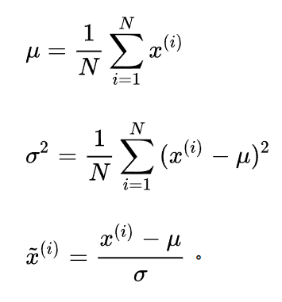

## 2-2 深度学习的数据处理（下）

上节课我们讲了数据的重要性，并重点介绍了几个著名的数据集，让大家直观看到了数据是什么。本期我们要讲一讲如何打造出一个优秀的数据集。

通常的数据集生产过程总共分为四步，包括数据采集、数据清洗、数据标准化、数据增强。

我们逐一讲解。

### 1. 数据采集

我们说公开的数据集就好像人工开采的翡翠原石，那么数据处理过程，就好比翡翠开采过程，而互联网就是埋藏翡翠的宝山。

这座宝山有多大？一份来自国外的报告显示，截至2021年1月全球手机用户数量为52.2亿，相当于世界总人口的66.6%。互联网用户数量为46.6亿，而社交媒体用户数量为42亿，同比增长逾13%。


在网民数量增长的同事，人均上网时长也在增加，目前互联网用户平均每天上网时间接近7小时，相当于每周上网48小时。而随着短视频的爆火，从blog到plog再到vlog，网民产生的数据量也是越来越大。2020年，全球互联网产生的信息量接近44ZB,要知道1ZB大致等于一千EB，一百万PB，十亿TB，一万亿GB。


面对互联网上如此多的数据，我们仿佛置身于喜马拉雅山，想要开采出有价值的“翡翠”又谈何容易。

此时就需要用到互联网的“挖掘机”——爬虫了。爬虫是一种互联网探测工具，它可以模拟人类在各个网站之间来回跳转，其速度则是人望尘莫及的。

在讲爬虫之前，我们先看看互联网世界是什么样的。我们浏览的每一个网页，都像一间房间，网页的链接就是房间的钥匙，想要进入房间，就必须有钥匙。向我们熟知的一些门户网站，比如新浪、网易、搜狐等等就好像公寓管理员，手里掌管着公寓每一个房间的钥匙，让人们可以快速找到自己想去的“房间”。而每一个房间里，又有很多其他房间的钥匙，让人可以穿梭于不同的房间。

在这个世界中，爬虫就是一只吃“钥匙”的怪物，当它进入一个房间，会把房间里的所有东西，也就是网页数据，都复制一份下载下来。然后再把所有的“钥匙”吃进肚子里，并进入这些钥匙对应的房间，重复做同样的事情。随着爬虫进入的房间越来越多，下载下来的东西也会越多，这些下载下来的页面，就是我们最原始的数据，也就是“翡翠原石”。比如我们要搜集美女的图片，可以先通过浏览器打开百度图库搜索美女。


随着我们向下滑动页面，更多的美女图片被加载进来，说明这个页面的内容是通过javascript动态加载进来的。

可以按F12，进入开发人员工具，在Network选项卡中点击Fetch/XHR，不同浏览器可能界面不一样，但是功能都是差不多的，这里我们用的chrome浏览器。


接下来随着页面滑动，可以看到绿色的加载条出现了，说明百度图片是随着用户浏览行为动态加载的。点击以后就能看到图片的资源链接。


点击payload可以看到链接的参数。


这些信息都是我们编写爬虫要用到的。下面来看代码：


其中params的内容我们没有展开，实际上就是链接里相关的参数。


执行结果如下：


这是一条JSON格式的数据，格式化一下，可以看到结构如下：


其中红框圈起来的这个thumburl就是图片的链接地址。接下来编写代码利用链接把图片下载下来。


现在来看看我们的成果吧。


这只是第一页的数据，想要爬取多页，可以通过设置不同的pn参数值来解决。大家可以动手试试。


网络爬虫除了能帮助你获取训练模型所需的数据，也能帮你快速搜集到自己喜欢的美图、视频、电子书之类的。作为一种工具，爬虫本身无罪，还能极大地提升工作效率，像是大家经常使用的百度搜索引擎，也是基于爬虫技术实现的。

但如果使用方法不当，却有可能让你触碰法律的红线。比如大家深恶痛绝的各种恶意抢票，微博刷粉，论坛灌水等等。希望大家在使用的过程中能够坚守底线，不要用技术谋取不当利益。

### 2. 数据清洗

为什么要进行数据清洗呢？当然是因为很多“脏”数据的存在。数据清洗的主要任务是发现数据集中有错误的“脏”数据，主要包括一致性检查和无效值/缺失值处理。

一致性检查是检查数据取值是否在正常范围内，比如考试成绩100分满分，超过100的就是要清洗的对象。无效值/缺失值处理则更好理解，就是把无效或缺失的数据删除掉，或者用均值、中位数等方式，填充缺失值。

这些技术对于传统机器学习算法非常重要，因为需要依靠数据人工提取特征。但对自动学习数据特征的深度学习来说，重要性并没有那么高，这是因为深度学习的容错率更高，它要学习的是真实数据分布，而真实数据一定会有错误、缺失、无效数据的存在。

后面我们会讲到，在某些任务中，为了提升模型泛化能力，我们还要给数据里面增加噪声。

因此，深度学习的数据清洗，主要目标还是剔除人为造成的错误，比如错误的标注，让数据标签更准确一些。

### 3. 数据标准化

数据标准化也叫归一化，是对每一维度的数据取值进行缩放，让数据取值在一个特定范围内，比如0-1之间。

为什么要进行数据标准化呢？

首先是为了让数据不受计量单位的影响。比如我们计算身高体重和一个人健康的关系，身高单位是厘米，体重单位是吨，那么最终身高的权重一定远远小于体重的权重。可以想象，身高变化一厘米对健康的影响，应该远远小于体重变化一吨带来的影响吧？这样带来的坏处就是，我们无法通过简单的比较权重大小，来判断身高和体重哪个对健康的影响大。这里开了个玩笑，但是道理并不假。

另一个更为重要的好处，则是可以让模型训练更加高效。这部分的原理对新手来说有些复杂，在我们讲完梯度下降算法以后，会再做解释。

那么数据归一化又有哪些方法呢？最简单的标准化方法是离差标准化，也叫min-max标准化或者缩放归一化。方法很简单，就是先找到该指标整体样本的最大值和最小值，然后每个样本的样本值减去最小值，再除以最大值减去最小值的差。


一行代码即可搞定。

```
def Normalization(x):
    return [(float(i)-min(x))/float(max(x)-min(x)) for i in x]
```

这种简单粗暴的方法有一个比较明显的缺点，就是当有新数据加入时，可能导致最大值或最小值的变化，需要重新计算。

最为常见的方法则是标准差标准化，也叫z-score标准化。经过处理的数据符合标准正态分布，即均值为0，标准差为1。



计算流程也不复杂，先求出指标整体样本的均值和标准差，然后用每个样本得取值减去均值再除以标准差。代码实现如下：

```
import numpy as np

def z_score(x):
    x -= np.mean(x)
    x /= np.std(x)
    return x
```

这种方法适用于指标的最大值最小值未知的情况。除此之外，标准化方法还有很多，比如Decimal scaling小数定标标准化，对数Logistic模式，atan模式，模糊量化模式等等，有兴趣的同学可以自学。

### 4. 数据增强

我们在上一节课讲过，深度学习的对数据量有很高的要求，虽然不一定要像IMAGE-NET那样动辄几千万的数据量，但即便最简单的任务，数据量也至少要达到几千。

当数据量不够时，我们就需要通过数据增强算法来扩增数据集。以图像算法为例，当我们没有足够的图片作为输入时，可以简单的通过翻转、旋转、缩放比例、裁剪、移位等方式来实现扩增。

我们以翻转为例，当前很多深度学习工具本身自带翻转功能，比如鼎鼎大名的PyTorch，通过如下几行代码就能实现翻转功能。

```
import PIL.Image as Image
import os
from torchvision import transforms as transforms

outfile = './samples'
im = Image.open('./test.jpg')
im.save(os.path.join(outfile, 'test.jpg'))

new_im = transforms.RandomHorizontalFlip(p=1)(im)   #随机水平翻转
new_im.save(os.path.join(outfile, '3_1.jpg'))
new_im = transforms.RandomVerticalFlip(p=1)(im)     #随机垂直翻转
new_im.save(os.path.join(outfile, '3_2.jpg'))
```

实际效果就是这样：


对于深度模型，会认为这是三张完全不同的图片。旋转也是一样，几行代码即可解决：

```
new_im = transforms.RandomRotation(90)(im)    #随机旋转90度
new_im.save(os.path.join(outfile, '4.jpg'))
```


除了翻转、旋转这种简单操作，还有一种方法叫做MixUp，就是把两张图片直接叠加混合，正所谓“看山不是山，看水不是水”，然而却能在深度学习中起到效果。

除此之外，如果数据集过于“干净”，还可以给图像增加“噪声”。增加噪声的意义在于，让模型学习到图像的主要特征，降低对其他不重要特征的敏感度。

就好像我们认识一个人，应该关注他的长相而非穿着，增加噪声就好像给人换装，让模型知道，不管穿不穿马甲，你大爷还是你大爷。


除此之外，还可以使用更高级的GAN网络，增加一个专门生成图片的模型让它和图像判别模型左右互搏。这部分讲到GAN模型的时候再给大家重点介绍。

NLP领域的数据增强算法也并不复杂。对于文本数据，可以通过简单的同义词替换，生成一个新的句子。比如，我喜欢吃土豆，可以简单的替换为我爱吃马铃薯。

实现方式简单粗暴的是建立一个同义词词典直接替换，高端点的就是基于词向量相似度计算，又或者基于bert这种掩码语言模型。

另一种常用的增强方法是回译，比如有一句话是，“冬奥会开完了，我还没买到冰墩墩”，翻译成英文就是“The Winter Olympics are over and I haven't bought Bing Dwen Dwen yet”。再翻译回来就是“冬奥会已经结束了，我还没买冰墩墩呢”。句意没变，但是内容发生了变化，可以认为增加了一条新样本。

NLP领域也可以给数据增加噪声，简单粗暴的就是给句子里随机插入、交换或者删除一些词。
有点技巧的可以是故意增加错误，比如同音词替换，形近字替换。或者直接调整文章中句子的顺序。

还有一些方法据说参考了生物杂交实验，就是把两个句子切断，然后交换后半部分。感觉上有点驴唇不对马嘴，但效果却是正向的。

这些数据增强算法，在实际应用中，各有不同的适配场景。大家在实用的时候可以根据具体问题，选择适用的手段。

本次课程介绍了数据处理过程中比较重要的四个步骤，数据采集、数据清洗、数据标准化、数据增强。经过这些操作以后，我们的数据调整就算告一段落，接下来就要选择模型开始训练了，常用模型有哪些，各自有什么特点，我们又该如何选择？

敬请关注梗直哥，我们下次再见。
