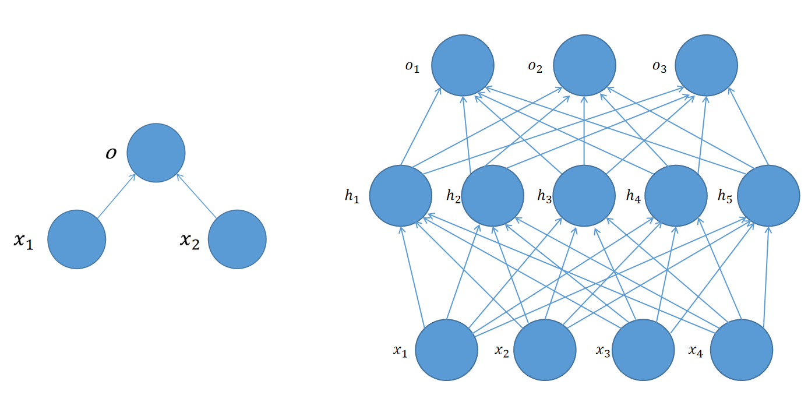
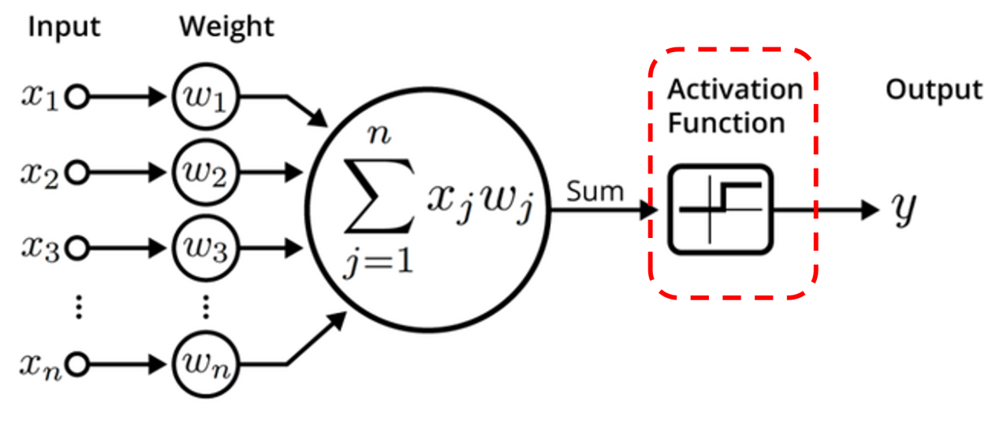
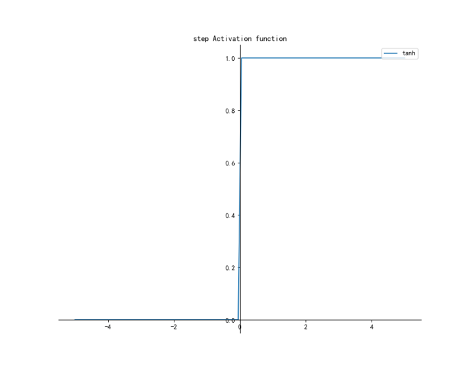
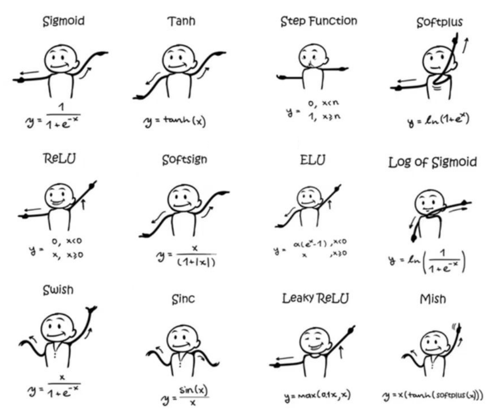
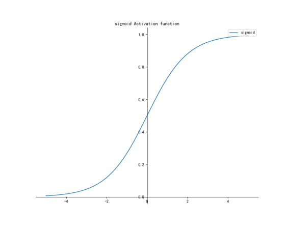
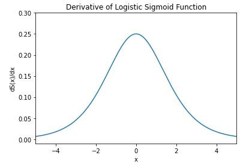
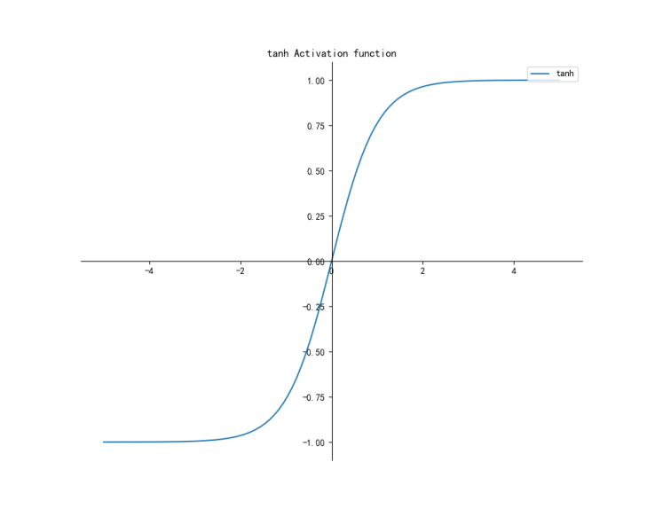
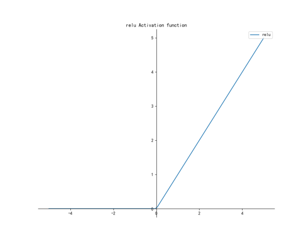
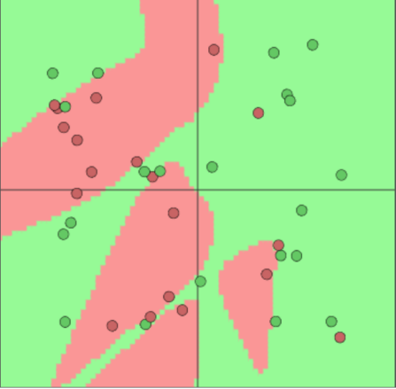
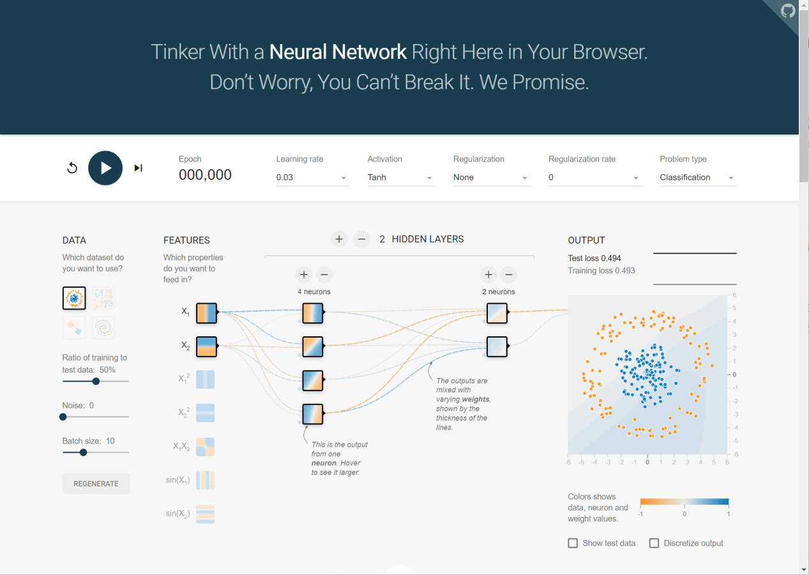

3-2 人工神经网络（下）
----------------------

我们说深层神经网络打开了深度学习的大门， 它究竟有什么神奇之处呢？

我们先来看看它的结构。

如图左侧是\ **单层网络**\ ，右侧是\ **深层网络**\ 。

对比我们前面看到过的单层网络，这次终于看出点网络的样子了。其中输入层X，隐藏层H，输出层O中的所有节点全部实现层级间完全连接，因此隐藏层和输出层都可以被称为全连接层。

可以直观看到，深层网络是在单层网络基础上增加了一层隐藏层h，网络从原来的一层，变成了两层。而随着隐藏层数量的增加，网络也可以变得越来越深，参数量递增的同时，模型的能力也在增强。

为什么增加层数可以提升模型的效果呢？直观的理解是三思而后行比凭着直觉做事情更有把握。实际上，随着隐藏层的增加，模型可以自动从数据中学习到各种复杂的特征，就好比一个人能够更加全面的多次权衡，最后做出的判断也会更加准确。

那么既然增加隐藏层可以提高模型效果，我们是否能够无限的堆叠下去呢？

答案是否定的，在前面课程中，我们讲过模型训练中可能会出现的一个问题——过拟合，就是当模型过度学习了训练集的细节，导致模型在训练集上表现完美，在测试集上一塌糊涂。过度增加模型的深度，就会导致这一问题。那么什么样的深度比较合适呢？一般来说还是靠人的经验，也正因为如此，很多人把深度学习比作炼丹，火候的掌握需要你炼废几炉子丹药才能学会。

像这样增加隐藏层，真的会让网络产生质变吗？我们可以比较一下两种网络。我们知道一个单层网络的最终输出\ :math:`O=XW+b`\ ，那么增加一层隐藏层会怎么样呢？

可以看到隐藏层输出\ :math:`H=XW_h+b_h`\ ，输出层结果\ :math:`O=HW_o+b_o`

将隐藏层结果带入可得

.. math:: O=(XW_h+b_h)W_o+b_o

打开括号

.. math:: O=XW_h W_o+b_h W_o+b_o

了解线性代数的话，可以很容易看出，我们令\ :math:`W_h W_o=W`\ ，\ :math:`b_h W_o+b_o=b`\ ，那么输出的形式和单层网络输出\ :math:`O=XW+b`\ 完全一致。这就好比古代战场上，你有再多的刀枪，把他们拼接起来，也还是只能近战，无法远程攻击敌人。

从数学角度分析，线性函数具有可加性和齐次性，因此任意线性函数的连接都可以等价为一个单一线性函数。这也和我们得出的结论一致。

如此说来，无论我们添加多少隐藏层，模型最终也会退化成单层网络，这与前面讲的完全对不上啊。各位先别急，接下来我们就来介绍战场上的远程弓弩——解决线性网络退化问题的神器，激活函数。

引入非线性激活函数，提高了模型的鲁棒性，赋予模型非线性表达能力，缓解了梯度消失问题，加速了模型的收敛速度。那么它是如何做到的呢？

其实很简单，我们给网络的每一层输出套上一个非线性激活函数，计算以后再作为下一个层的输入就行了。

要加入非线性，那么可以从最简单的二分类激活函数阶跃函数开始，它的图像如下：

这张图本身很好理解，当输入大于零，就被分类到1，小于零就分到0。但是激活值只有0和1未免过于简单粗暴，我们希望它可以得到0到1之间的任意值，这样就可以用这个数值表示分到这一类别的概率。

下面这张图给出了常见的激活函数图像和公式：

这里我们重点介绍其中的三个，Sigmoid、Tanh和ReLU。

**1. Sigmoid**

Sigmoid是一个如下图形状的S型曲线，可以将元素的值映射到0，1之间。

它的公式和代码如下：

.. math:: Sigmoid(x)=\frac{1}{1+e^{-x}} 

.. code:: ipython3

    import numpy as np
    def sigmoid(x):
       return 1 / (1 + np.power(np.e, -x))

在早期的神经网络中经常用到，但目前逐渐被ReLU函数所取代。

这个问题的原因，涉及到反向转播的求导，这部分内容还没有讲到，因此只做简单说明。

神经网络通常基于梯度下降和反向传播算法来训练参数，在反向过程中，需要对每一个函数进行求导。Sigmoid的导函数图像如下：

可以看到最大值只有0.25，这样在链式法则的连续相乘过程中，很快就会让梯度趋近于0，这种就叫做梯度下降。同时由于Sigmoid函数的输出恒大于0，会导致收敛速度较慢，训练时间比较长。

这些sigmoid函数的缺陷，也导致了后续新的激活函数层出不穷。

**2. Tanh**

Tanh也是一个形如Sigmoid的S型曲线，区别是它的取值范围是-1到1。

能够输出负数，让模型的收敛速度得到了提升，但是实际上Tanh只能算是sigmoid函数的变体，所以和Sigmoid函数一样也会出现梯度消失问题。

.. math:: Tanh(x)=2Sigmoid(2x)-1

Tanh的代码如下：

.. code:: ipython3

    import numpy as np
    def tanh(x):
       return (np.exp(x) - np.exp(-x)) / (np.exp(x) + np.exp(-x))

**3. ReLU**

ReLU是Rectified Linear
Unit的缩写，翻译过来叫修正线性单元，函数图像如下：

表达式也很简单：

.. math:: ReLU(x)=max(0,x)

Relu的代码如下：

.. code:: ipython3

    import numpy as np
    def relu(x):
       return np.maximum(0, x)

ReLU是当前比较主流的激活函数，大部分场景下效果要好于Sigmoid和Tanh，其原因主要是解决了梯度消失问题。ReLU函数的导数如下：

.. math::

   \frac{\mathrm{d}ReLU(x)}{\mathrm{d}x} =
   \left\{\begin{matrix} 
     1, x>0 \\  
     0, x<0 
   \end{matrix}\right. 

非常简单粗暴，但是效果却很好，模型的收敛速度更快。

值得注意的一点是，ReLU也并非完美无缺，由于它对于负数的导数永远为0，因此神经元的参数永远无法更新，当初始化参数时出现负值或者学习率设置较大导致参数更新幅度过大变负时，神经元就等于“死亡”了。

因此在设置学习率时，最好设置一个较小的数值。

对初学者来说，了解这三个激活函数已经足够了。至于其他的，将会在我们的进阶课程中再做讲解。每一个激活函数都要考虑输入输出以及数据变化，在实际应用中要谨慎选择。

激活函数赋予了深度神经网络意义，而随着网络结构的加深，神经网络则能够解决各种各样复杂的线性不可分问题，深度学习的时代就此到来。

关于实践部分，这次我们不需要自己敲代码，网上有一个非常有意思的小工具。

http://playground.tensorflow.org/

最上面一排，可以设置各种学习率、选择激活函数、选择正则化项以及比率、选择问题类型。问题类型包括分类和回归；学习率会影响模型的收敛效果以及训练速度；激活函数我们刚讲完；正则化项则主要包含L1正则化和L2正则化，这里简单介绍一下。

正则化的目标是限制参数权重值的大小，减少过拟合的风险，所以又称为权重衰减。举个简单的例子，在选举过程中，你是希望只听几个权利极大的人的意见，还是希望听到所有基层群众的声音？为了避免模型被个别几个权重较大的参数所左右，因此要在损失函数后面加上惩罚项。

L1正则化项是权重向量w中各元素的绝对值之和，它的惩罚比较平均；L2正则化项是权重向量w中各元素的平方和，他对于大数值的权重惩罚更加严厉。L1主要用于进行稀疏化，就是让一些参数变成0，通常用于多特征的特征选择，也可以一定程度上防止过拟合；L2则主要用于避免模型发生过拟合现象。在实际应用中，一般来说L2正则化的效果要好于L1正则化。

左侧的DATA部分可以选择数据集，橙色和蓝色的点就是我们要分类的目标。下面还可以设置训练集和测试集的比例，噪声数据的数量，以及batch
size的大小。

这里的batch size，对新手来说，又是一个新的概念，但实际上很好理解。Batch
Size就是我们一次性送入模型的样本数量，batch
size越大，模型的训练速度也就会越快。这区别就好像个人投票和小组投票，比如100人的班里面投票选择春游目的地，原本的流程是老师一个一个的询问同学想去哪里，最后选出投票人数最多的选项，那么要询问（训练）100次。设置了batch
size的话，就相当于给班级分了小组。比如batch size = 10,
那么就是10人一小组，小组投票等于组内最多人投票的选项，然后老师会询问每个小组的意见，最终只需要询问（训练）10次就够了。

这里有一个有意思的问题，当batch
size持续增大，以至于等于了训练集的数量会怎么样呢？有兴趣的同学可以研究一下。

实际应用中，batch size不能设置过大，因为GPU的显存是有限的，batch
size太大会导致显存不够用，程序就没办法正常执行了。

FEATURES部分，可以选择神经元的运算方式，默认是一次函数。中间部分就是隐藏层了，可以点击“+”、“-”来增加或减少隐藏层的数量，下面还能通过“+”、“-”来控制每一层神经元的个数。

当你的网络配置完毕以后，点击最上面的运行按钮，模型就开始训练了。有兴趣的话可以动手试一下，看看你自己定制的模型效果如何。

从字符识别、人脸识别、语音识别到自然语言处理、无人驾驶，人工神经网络在互联网、军事、安防、金融、医疗等千行百业攻城略地、遍地开花。然而这种简单粗暴的算法真就完美无缺吗？

当然不是，神经网络也有着自己的缺陷，缺乏理论基础、优化困难、算力需求大、可解释性差等等问题，让神经网络的发展过程一波三折，经历了数次大起大落。举例来说，神经网络的一个重大问题是模型要设置的超参数很多，参数选取的经验要通过实践去积累。

超参数包括网络神经元的个数，隐藏层的层数，学习率大小，batch_size大小等等，神经元太少或层数太浅，有可能导致模型难以收敛，训练不出结果。神经元过多或层数过深，则可能导致模型产生过拟合，也就是前面讲过的在已知的训练集上有效，在未知的测试集上无效。

正如我们说训练神经网络好像炼丹，要经过各种失败，才能勉强成丹，好不容易总结出一张靠谱的丹方，任一炼丹条件发生变化，也可能会导致失败。比如，初始化参数的方法，训练数据集，优化器，正则化方法等等。

尽管神经网络有如此多的缺点，但正是它的出现，开启了深度学习的时代，后世的所有模型比如CNN、RNN都是在它基础上的创新，并一定程度上解决了他所存在的问题。

下节课，我们就一起来聊一聊站在神经网络巨人肩膀上的模型之一，视力卓越善于发现特征的“工匠”——CNN模型。
我们下节课再见。
