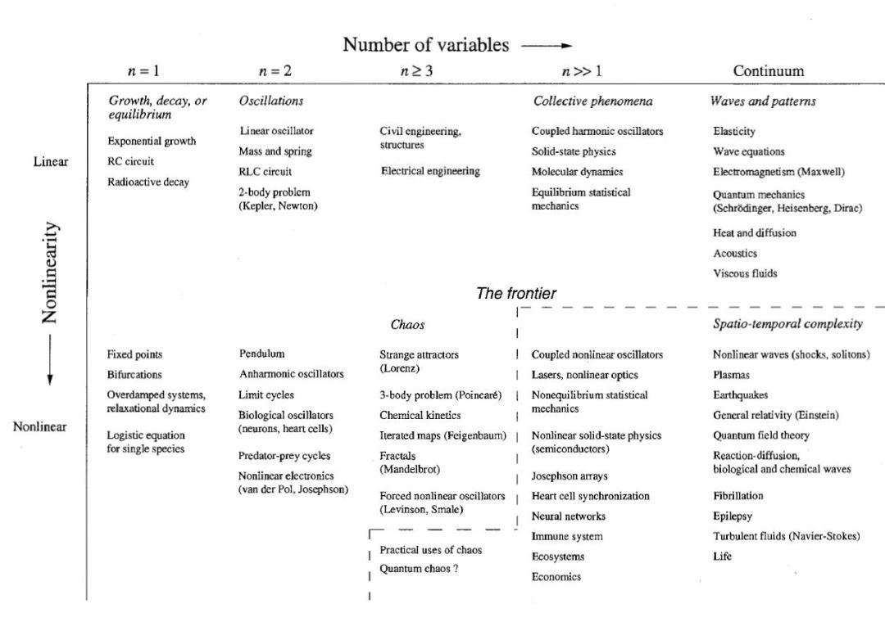
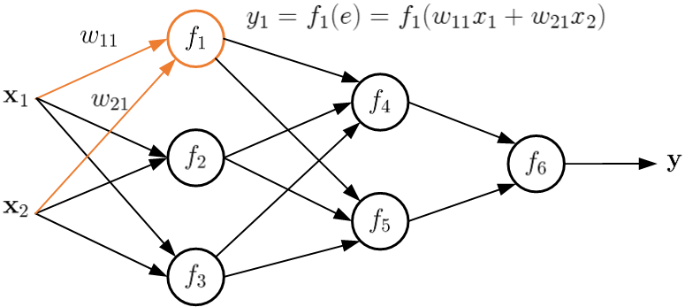
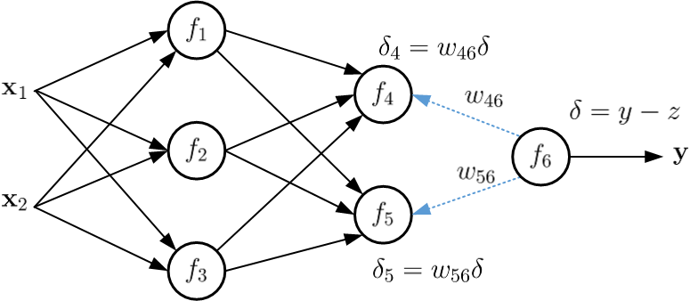
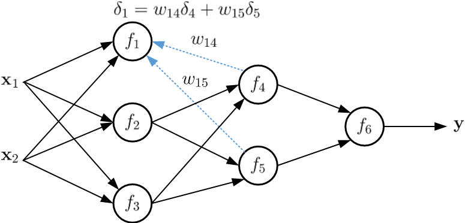
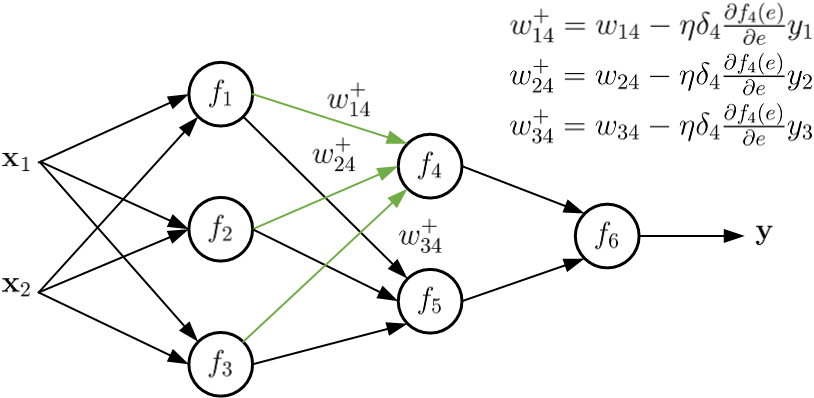

3-3 反向传播的深入理解
----------------------

反向传播（Back
Propagation）是深度学习中的核心算法，几乎是所有神经网络训练学习的基础。对它的认知十分重要，但初学者往往会陷入两个极端：要么只浅显的明白是误差的传递，但对于为什么倒推及怎么计算不熟悉；要么陷入数学公式和细节，只会一个个例子却看不清全貌。能否既深刻理解，又好记不忘呢？

本期就让我们借助好莱坞经典同名高分烧脑大片《蝴蝶效应》来深入认识反向传播的本质。

“哪怕是小小的蝴蝶扇动一下翅膀，也能造成千里之外的飓风”，这就是混沌理论中著名的蝴蝶效应（Butterfly
Effect）。它描述了在一个动态系统中，初始条件的微小变化，却能带动整个系统长期且巨大的链式反应。影片讲述的是具有能穿越过去超能力的主人公埃文生命过程中的蝴蝶效应。每次回到过去，一个小小的改变却像蝴蝶震动了翅膀，带来故事情节的急速闪变。前一个悲剧消失，却引发另外的悲剧、更大的变化，验证了蝴蝶之羽翼的轻轻摆动足以引发人生的海啸。奇幻的时空交错，思维的不断重组。在感慨人生的同时，你有没有好奇，主人公埃文为什么要一次一次的穿越，而每次穿越后结果又各不尽相同呢？

无论神经网络，还是混沌现象，都是典型的非线性动力学系统（Nonlinear
Dynamical
System）。简单的说就是跟求导相关的系统，通常用微分方程或差分方程才能描述其动力学特性。根据国际著名非线性动力学家、美国科学院院士Strogatz教授的分类，用动力学的角度看世界的话，如下图所示：

其中横轴是系统变量维度，纵轴是非线性程度。我们可以看到混沌理论（Chaos）在中间，是三维非线性；著名的三体问题（3-body
problem）也是这个维度的；而神经网络则是更高维的非线性动力学系统。

这类系统的复杂性来源于非线性造成的不稳定性和对初始条件的极度敏感。通常一个系统都会受到各种小的扰动，非线性则会放大这些扰动。以混沌为例，系统一方面对于初始条件依赖，另一方面又在有限范围内运动，这使得那些初始状态和速度充分接近的轨道会以指数速度分离开来。由于轨道自己不能相交
，所以它们只能在有限的空间内缠绕往复而形成非常复杂的形状，这就是所谓的“混沌”。电影中的每次穿越其实都是一条新的人生轨道。

对神经网络而言，正常情况下，它的信息流都是前向传播的。如下图所示：一个由两个隐藏层六个神经元组成的网路，\ :math:`f`\ 表示神经元的激活函数。输入数据经过加权线性组合，激活函数实现非线性变换，在不同层级间反复迭代，得到最后的输出。就如同人生，一路向前不可逆转。网络中的每条链路组合都形成了一条人生轨道。

电影脑洞大开，想象了一种奇幻的场景：男主埃文拥有超能力，当面对理想与现实的巨大落差时，可以穿越回过去重写命运。深度学习中，反向传播算法的思想可谓与电影构思异曲同工。通常神经网络的训练往往以随机参数开始，初始输出结果一般都不尽人意。因此，学习的目的就是赋予它穿越的力量，使其能够不断更新自我，最终实现完美的效果。

那么问题来了，到底怎么做呢？

电影中，20岁的埃文每次穿越都选择最惨的关系入手。先是因为女友凯丽的自杀，第二次是抑郁的好友兰尼，最后是为了患癌症的妈妈。穿越时间也分为13岁和7岁两个层级。通过分解问题找到的事发原因，所有的故事情节都会随之发生新的变化。这个过程是不是像极了有两个隐藏层、多个神经元的网络？不同的人物对应不同的神经元，层级对应时间。

在这种类比下，误差损失函数描述的就是对生活的不满意程度。比如，通常我们可以用理想值和实际输入的均方差来表示，其中f是激活函数，z是最终结果的标准值，N是训练样本个数。

.. math::  E =\frac{1}{2N} \Sigma_x\|f_w(x)-z\|^2 

对它的最优化问题是对完美大结局的不懈追求，目的就是尽量缩小这种误差。所以，在损失函数前加了一个最小化算子。

.. math::  \mathbf{min}_w \frac{1}{2N}\Sigma_x\|f_w(x)-z\|^2 

在深度学习中，这可以用梯度下降法（Gradient
Descent）来实现。具体说，就是根据梯度逐步更新权重参数：

.. math::  w^+=w-\eta\cdot\frac{\partial E}{\partial w} 

其中\ :math:`\eta`\ 是学习率，一般选择0-1之间的小数。求导\ :math:`\partial E/\partial w`\ 则体现了网路的非线性动力学特性，类比电影就是每次穿越都要先找最惨。换句话说，在损失函数确定的情况下，反向传播最难的就是求导了。

正如可怜之人必有可恨之处，找最惨要像剥洋葱一样一层层的进行。对损失函数这样的复合函数，不同层间连续穿越称为求导的链式法则。具体来说，可以分解为两步实现：

首先，按网络关系把误差乘以每条链上的权重。下图以输出神经元\ :math:`f_6`\ 为例，进行误差分解。

如果同一个神经元有多条链的话，就汇聚求和。例如下图所示神经元\ :math:`f_1`\ ，

以此类推，这样一级级传递，把误差责任倒查分摊。

其次，获得每个神经元的误差后，再根据各自的梯度公式，逐个更新链接的权重。每个神经元的梯度可以根据复合函数的链式求导法则获得：

.. math::

    
   \begin{equation}
   \begin{aligned}
   \frac{\partial E}{\partial w_i}&= \frac{\partial (\Sigma_x\|f(x)-z\|^2)}{2N \cdot \partial w_i}\\
   &=(f_i(x)-z)\frac{\partial f_i(x)}{\partial w_i}\\
   &=\delta_i \cdot\frac{\partial f_i(e)}{\partial e}\cdot \frac{\partial e}{\partial w_i}\\
   &=\delta_i \cdot\frac{\partial f_i(e)}{\partial e}\cdot x_i
   \end{aligned}
   \label{f2}
   \end{equation} 

其中\ :math:`x_i`\ 表示第i号神经元的输入，\ :math:`e_i=w_ix_i+b_i`\ 是该神经元的输入线性组合，\ :math:`f_i`\ 是它对应的激活函数。让我们以其中的\ :math:`f_4`\ 神经元为例，看看它是如何调整输入权重的：

如果喂给神经网络一个训练样本，就更新一次权重，这被称为随机梯度下降法。如果把所有的样本都喂给神经网络并计算误差后，再统一调整权重，这叫批量梯度下降法。当然，还有一小批一小批喂的方式，每次调整一下权重，叫做小批量梯度下降法。

总得来说，神经网络的反向传播，就如同电影中人生不断地穿越重写。通过成千上万个训练样本一遍遍的自我救赎，最终实现对完美结果的执着追求。

在这个过程中，蝴蝶效应所要强调地是：哪怕参数的一点点变化，经过层与层之间激活函数带来的非线性空间映射都可能产生巨大的差异。因此，科学合理的损失函数、学习率，以及不同的梯度下降算法对神经网络的训练都很重要。

科学和艺术，看似不想干的两个领域，往往却有着深层次的逻辑联系。这也是为什么博士学位往往被称为Doctor
of
Philosophy的原因了。想要学好机器学习，在看似枯燥的理论和算法背后，多思考其中的道理。毕竟人工智能，研究的还是人生的智能。通过恰当的类比，更容易深刻理解算法设计的初衷。

[1] Steven H. Strogatz. NONLINEAR DYNAMICS AND CHAOS with Applications
to Physics, Biology, Chemistry, and Engineering (second edition), Boca
Raton, FL: CRC Press, 2018

[2] 盛昭瀚，马军海，“非线性动力系统分析引论”， 科学出版社， 2001
