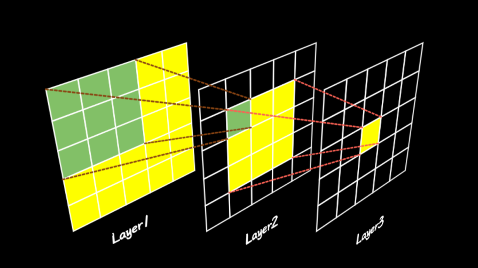

3-4 卷积神经网络
----------------

上期我们讲了深度学习最基础的模型全连接深度神经网络，本期梗直哥给大家带来的是站在神经网络巨人肩膀上的模型之一，“视力”卓越善于发现特征的“工匠”——CNN模型。

如果说神经网络是个黑盒子，吃进去数据，吐出来结果，那么不同神经网络的最大区别就是肚子里的网络结构。卷积神经网络有什么过人之处呢？我们首先来宏观的看一下它的网络结构。

1. 卷积神经网络结构
~~~~~~~~~~~~~~~~~~~

卷积神经网络英文为Convolutional Neural
Network，简称CNN，模型结构如下图所示。

左侧是输入层，可以是文字、语音、图像、视频等各种数字化信号。最右边是输出层，一般是分类的类别及其概率。比如我们要识别手写体数字，那输入就是手写体图片，输出就是0-9这10个数字；要识别车型，那输入就是车子的图片，输出就是奔驰、宝马、奥迪等品牌的概率。

它的就蕴含着三种不同的网络层：卷积层、池化层和全连接层。多个“卷积+池化”结构层层连接，就是卷积神经网络最重要的特点。

1.1为什么用卷积层呢？
^^^^^^^^^^^^^^^^^^^^^

坦率地讲，它其实和神经网络一样，是计算机学者受生理学家和数学家的启发而创造出来的。开始算力不行，数据也少，只能靠想象。后来硬件升级，数据也多了，通过实验发现效果很好，从而一炮走红。

一般的全连接神经网络结构如下：

节点表示神经元，连线表示计算关系，每条线都有个权重。所谓的学习或者训练就是：喂数据，调整权重。如果用审美的眼光来看，他就像个体态臃肿的大胖子。为什么这么说呢？因为每层节点都和上一层的所有节点相连，构成所谓的全连接网络，看似密密麻麻，其实冗余度大，无效的肥肉多，一点也不结实性感。

也就是所谓的光吃饭不干活，空有一身赘肉，力气却不大，显得特别的笨。从模型角度来说，就是参数众多、难以训练。

举个例子，哪怕输入是个100x100
的小图像，全连接层的每个神经元就要有10000个参数，如果要保证输出维度仍然是100x100，全连接层就要有10000个神经元，总计需要1亿个参数。而且层数一多，就会容易产生过拟合，就好像吃饭挑食，没见过的不吃。

卷积运算恰恰相反，以二维图像为例，小小的3x3卷积核却能起到特征提取的大作用。通过二维离散卷积操作，把全连接变成了一个个小的局部连接，实现了高效的图像特征提取。

无论图像大小如何，使用卷积操作，每个滑动区域都具有相同的共享权重，如果使用3x3大小的卷积核，就只需要学习9个参数。从1亿个参数变成9个，卷积核帮助神经网络在能够保证性能的条件下实现了瘦身。

这些小小的卷积核还具备着传说中的空间平移不变的特性，简单理解，就是对于一张照片，不管你的脸在哪个位置，它都能找出来。

卷积运算得到的结果，常常被称作：特征图feature
map，特征图上的每个点，都是由上一层的若干个点共同决定的，比如3x3卷积核时，每个点是由上一层的9个点决定，我们就把这个9叫做这一点的感受野。可以想象一下，网络层数越多，每一点的感受野就越大。而感受野越广阔，就越能够捕捉更大尺寸的特征。

如果一层卷积不够强，那就层层堆叠起来，这就是所谓的深度卷积网络。卷积层数越多，对复杂特征的表达能力越强，其实这也很好理解：

以图像分类为例，在多层卷积网络中，第一层可以表示在特定的位置和角度是否出现边缘；而第二层则可能能够将这些边缘组合出有趣的模式，如花纹；在第三层中，也许上一层的花纹能够进一步汇合成物体特定部位的模式。这样逐级表示下去，就能学到图像的各种特征了。

我们前面讲过神经网络之所以能解决非线性问题，本质上就是加入了激活函数这一非线性因素，否则就和线性回归区别不大。卷积神经网络也不例外，科学家们在卷积过后，也加入了激活函数。

卷积神经网络最常用的激活函数也是ReLU函数，就是把特征图上所有的负数都变成0，而正数不变，它能够有效避免梯度消失。

1.2 池化层的作用
^^^^^^^^^^^^^^^^

池化层英文是Pooling，翻译的听上去有点晕，本意其实是淤积或者汇聚更贴切些。直白点儿说，就是抓主要矛盾，忽略次要因素。池化层把局部神经元的输出，组合成下层单个神经元来减少数据维度。用数学语言描述，就是在一个小矩阵中找最大值或者平均值，这就是所谓的最大池化或者平均池化运算。局部池化一般选择2x2的矩阵就够了。

卷积层屁股后边跟一个池化层，这个操作的目的是进一步放大主要特征，忽略掉几个像素的偏差。其意义不光能够降低数据维度，减少训练参数，同时还能避免所谓的过拟合，也就是别画蛇添足，学过了头。

1.3 全连接层
^^^^^^^^^^^^

卷积神经网络的最后往往都保留一到两个全连接层，其中最后一层全连接层也就是输出层。其作用好比从全局出发，做最终结论和前面的卷积层搭班子，形成了先局部，再整体的学习结构。输出层会给数据进行降维，将数据维度降低到和结果的类别数相等。“卷积+池化”多层级联，对输入数据进行多尺度特征提取和深度学习，这就是卷积神经网络的特点。

2. 卷积神经网络的由来
~~~~~~~~~~~~~~~~~~~~~

卷积和神经网络的最初相遇发生在计算机视觉领域，第一个发现者是日本学者福岛邦彦
他受前人关于生物视觉系统研究的启发，提出了层级化的人工神经网络，即“神经认知模型”，处理手写字符识别问题，这被认为是卷积神经网络的前身。

不过，卷积和神经网络真正意义上的合体被认为是法国学者,Yann
LeCuu等人在1998年提出
基于梯度学习的卷积神经网络算法LeNet,它被广泛应用于美国邮政系统的手写数字和字符识别。

卷积神经网络的第一次大放异彩，要回溯到2012年，在有计算机视觉界“世界杯”之称的ImageNet竞赛上，Hinton等人凭借AlexNet一举夺魁，这个网络的结构和LeNet非常类似，但是更深更大。并且使用了层叠的卷积层来获取特征，超高的识别率让学术界意识到了卷积对神经网络改造的巨大潜力。

之后，Google, facebook,
微软，国内的BAT等公司纷纷投入巨资研究，各种变体的卷积神经网络层出不穷。例如ZFNet通过可视化展示了卷积神经网络各层的功能和作用；牛津大学提出的VGGNet模型采用堆积的小卷积核替代采用大的卷积核；不仅能够增加决策函数的判别性还能减少参数量；GoogleNet增加了卷积神经网络的宽度，使用1x1卷积降维减少参数量，在多个不同尺寸的卷积核上进行卷积后再聚合；ResNet解决了网络模型的退化问题，允许神经网络更深。

总的来说，卷积神经网络在变得越来愈宽，越来越深，结构越来越复杂。

它的应用也从最初的计算机视觉，快速拓展到语音识别、自然语言处理等领域，进而应用到各种工程科学行业。

但不管怎么变，CNN的核心思想还是利用卷积核的特征提取能力，通过多层级联实现多尺度特征学习。

3. 卷积神经网络手动实现
~~~~~~~~~~~~~~~~~~~~~~~

接下来我们以MNIST模型为例，来实现一个卷积神经网络。模型框架依然选择PyTorch，前面讲过MINST作为深度学习的Helloworld,其数据集已经集成在各大主流的框架里面了，可以随用随取。

首先可以使用内置函数，下载MNIST数据集，代码如下：

.. code:: ipython3

    from torchvision.datasets import mnist
    
    # 使用内置函数下载mnist数据集
    train_set = mnist.MNIST('./data', train = True, download = True)
    test_set = mnist.MNIST('./data', train = False, download = True)

然后对数据进行一下预处理，包括调整数据形状、顺序和归一化：

.. code:: ipython3

    from torchvision import transforms
    from torch.utils import data
    
    data_tf = transforms.Compose(
        [transforms.ToTensor(),
         transforms.Normalize([0.5], [0.5])]
    )
    
    train_set = mnist.MNIST('./data', train = True, transform = data_tf, download = True)
    test_set = mnist.MNIST('./data', train = False, transform = data_tf, download = True)
    
    train_data = data.DataLoader(train_set, batch_size = 64, shuffle = True)
    test_data = data.DataLoader(test_set, batch_size = 128, shuffle = False)

然后就该建立网络了，首先引入网络模型包torch.nn来构造计算网络，定义一层卷积层网络的代码如下：

::

   self.layer1 = nn.Sequential(
       nn.Conv2d(1, 16, kernel_size=3),  
       nn.ReLU(inplace=True)
   )

定义池化层则是这样：

::

   self.layer2 = nn.Sequential(
       nn.Conv2d(16, 32, kernel_size=3),
       nn.ReLU(inplace=True),
       nn.MaxPool2d(kernel_size=2, stride=2)
   )

定义全连接层是这样：

::

   self.fc = nn.Sequential(
       nn.Linear(128 * 4 * 4, 1024),
       nn.ReLU(inplace=True),
       nn.Linear(1024, 128),
       nn.ReLU(inplace=True),
       nn.Linear(128, 10)
   )

当网络层都构建完毕以后，就可以定义一个forward函数，让数据按照顺序经过各层：

::

   def forward(self, x):
       x = self.layer1(x)
       x = self.layer2(x)
       x = self.layer3(x)
       x = self.layer4(x)
       x = x.view(x.size(0), -1)
       x = self.fc(x)
       return x

完整的网络结构代码如下：

.. code:: ipython3

    from torch import nn
    
    class CNN(nn.Module):
        def __init__(self):
            super(CNN, self).__init__()
    
            self.layer1 = nn.Sequential(
                nn.Conv2d(1, 16, kernel_size=3),
                nn.ReLU(inplace=True))
    
            self.layer2 = nn.Sequential(
                nn.Conv2d(16, 32, kernel_size=3),
                nn.ReLU(inplace=True),
                nn.MaxPool2d(kernel_size=2, stride=2))
    
            self.layer3 = nn.Sequential(
                nn.Conv2d(32, 64, kernel_size=3),
                nn.ReLU(inplace=True))
    
            self.layer4 = nn.Sequential(
                nn.Conv2d(64, 128, kernel_size=3),
                nn.ReLU(inplace=True),
                nn.MaxPool2d(kernel_size=2, stride=2))
    
            self.fc = nn.Sequential(
                nn.Linear(128 * 4 * 4, 1024),
                nn.ReLU(inplace=True),
                nn.Linear(1024, 128),
                nn.ReLU(inplace=True),
                nn.Linear(128, 10))
    
        def forward(self, x):
            x = self.layer1(x)
            x = self.layer2(x)
            x = self.layer3(x)
            x = self.layer4(x)
            x = x.view(x.size(0), -1)
            x = self.fc(x)
            return x

因为MNIST是一个图像分类任务，因此我们采用交叉熵作为损失函数，优化器则选取一个SGD，学习率设为0.1。

.. code:: ipython3

    from torch import optim
    net = CNN()
    criterion = nn.CrossEntropyLoss()
    optimizer = optim.SGD(net.parameters(), 0.1)

然后就可以开始训练了，我们迭代20个epoch。

.. code:: ipython3

    from torch.autograd import Variable
    
    nums_epoch = 20
    # 开始训练
    losses = []
    acces = []
    eval_losses = []
    eval_acces = []
    
    for epoch in range(nums_epoch):
        train_loss = 0
        train_acc = 0
        net = net.train()
        for img, label in train_data:
            # img = img.reshape(img.size(0),-1)
            img = Variable(img)
            label = Variable(label)
    
            # 前向传播
            out = net(img)
            loss = criterion(out, label)
            # 反向传播
            optimizer.zero_grad()
            loss.backward()
            optimizer.step()
    
            # 记录误差
            train_loss += loss.item()
            # 计算分类的准确率
            _, pred = out.max(1)
            num_correct = (pred == label).sum().item()
            acc = num_correct / img.shape[0]
    
            train_acc += acc
    
        losses.append(train_loss / len(train_data))
        acces.append(train_acc / len(train_data))
    
        eval_loss = 0
        eval_acc = 0
        # 测试集不训练
        for img, label in test_data:
            img = Variable(img)
            label = Variable(label)
            out = net(img)
            loss = criterion(out, label)
            # 记录误差
            eval_loss += loss.item()
            _, pred = out.max(1)
            num_correct = (pred == label).sum().item()
            acc = num_correct / img.shape[0]
            eval_acc += acc
        eval_losses.append(eval_loss / len(test_data))
        eval_acces.append(eval_acc / len(test_data))
    
        print('Epoch {} Train Loss {} Train  Accuracy {} Teat Loss {} Test Accuracy {}'.format(
            epoch + 1, train_loss / len(train_data), train_acc / len(train_data), eval_loss / len(test_data),
            eval_acc / len(test_data)))

.. parsed-literal::

    Epoch 1 Train Loss 0.4248322759949064 Train  Accuracy 0.8540778251599147 Teat Loss 0.054281586755724344 Test Accuracy 0.9824960443037974
    Epoch 2 Train Loss 0.05233270491285722 Train  Accuracy 0.9837919776119403 Teat Loss 0.04072430210417915 Test Accuracy 0.987440664556962
    Epoch 3 Train Loss 0.03406112580458998 Train  Accuracy 0.9895389125799574 Teat Loss 0.04150629113575656 Test Accuracy 0.986056170886076
    Epoch 4 Train Loss 0.023553986676631302 Train  Accuracy 0.9929204424307037 Teat Loss 0.03359005342983575 Test Accuracy 0.9895174050632911
    Epoch 5 Train Loss 0.019096489405900023 Train  Accuracy 0.9934201759061834 Teat Loss 0.0331763881822323 Test Accuracy 0.9896162974683544
    Epoch 6 Train Loss 0.01406838119037042 Train  Accuracy 0.9956523187633263 Teat Loss 0.027562565970180877 Test Accuracy 0.9910007911392406
    Epoch 7 Train Loss 0.009732766144289019 Train  Accuracy 0.9971681769722814 Teat Loss 0.027070942401445492 Test Accuracy 0.9913963607594937
    Epoch 8 Train Loss 0.007255095646518761 Train  Accuracy 0.9977345415778252 Teat Loss 0.03849012611223693 Test Accuracy 0.9899129746835443
    Epoch 9 Train Loss 0.006567338691955787 Train  Accuracy 0.9979677505330491 Teat Loss 0.033482366833328066 Test Accuracy 0.9910007911392406
    Epoch 10 Train Loss 0.005251464683191431 Train  Accuracy 0.9984008528784648 Teat Loss 0.026662164767410818 Test Accuracy 0.9915941455696202
    Epoch 11 Train Loss 0.0037919538000483867 Train  Accuracy 0.9989172441364605 Teat Loss 0.033687599447854974 Test Accuracy 0.9917919303797469
    Epoch 12 Train Loss 0.004235758415632669 Train  Accuracy 0.9987506663113006 Teat Loss 0.027855303110536883 Test Accuracy 0.992879746835443
    Epoch 13 Train Loss 0.0016764201298219501 Train  Accuracy 0.9995835554371002 Teat Loss 0.02943871770710412 Test Accuracy 0.9921875
    Epoch 14 Train Loss 0.0014280934057818038 Train  Accuracy 0.9996335287846482 Teat Loss 0.03190385157477667 Test Accuracy 0.9932753164556962
    Epoch 15 Train Loss 0.00046437270951641156 Train  Accuracy 0.999883395522388 Teat Loss 0.054851674089436774 Test Accuracy 0.9877373417721519
    Epoch 16 Train Loss 0.0007102458525310869 Train  Accuracy 0.9998001066098081 Teat Loss 0.03531602293521066 Test Accuracy 0.9923852848101266
    Epoch 17 Train Loss 0.00041162975972048774 Train  Accuracy 0.999883395522388 Teat Loss 0.033597190200253174 Test Accuracy 0.9936708860759493
    Epoch 18 Train Loss 0.00028991846968716157 Train  Accuracy 0.9999167110874201 Teat Loss 0.03534940891892817 Test Accuracy 0.9929786392405063
    Epoch 19 Train Loss 9.058931282500727e-05 Train  Accuracy 0.999983342217484 Teat Loss 0.03599908131119148 Test Accuracy 0.9931764240506329
    Epoch 20 Train Loss 4.243029736376825e-05 Train  Accuracy 1.0 Teat Loss 0.036835657221729864 Test Accuracy 0.9932753164556962
    

由于数据集不大，任务也比较简单，我们的模型在测试集上轻松跑出了99%的准确率。

4. 卷积神经网络的改进方向
~~~~~~~~~~~~~~~~~~~~~~~~~

传统的CNN对输入、卷积核、级联和初始化方法都没有严格要求，在这些方面都有很大的改进空间。比如，有人在用CNN做显著性检测时，就是把图像先进行了一把超像素分割，然后把分割后的超像素作为新的网络输入。

传统的CNN在进行特征提取时好比用筛子筛谷子，总认为，筛到最后就是精华，其实中间筛出去的东西也可以好好利用，有人把这种思想用在人脸识别上取得了很好的效果。

传统的CNN就是单纯的卷积核，其实也可以用其他类型的矩阵，比如Gabor滤波器、小波核之类的也许会有不错的效果。

除了网络结构上的改进，在训练算法上也有很大的潜力，比如对非线性激活函数的改进。比如，ReLU函数对所有的负数一律取0，可能会导致神经元“死亡”。因此衍生出了Leaky
ReLU，给所有负值赋予了一个非零斜率，解决了这一问题。类似的激活函数还有很多。

以上就是这期的内容了，下期我们要讲的是在神经网络巨人肩膀上的模型之二，记忆力惊人又善于写日记的“工匠”——RNN模型。

我们下期再见。
