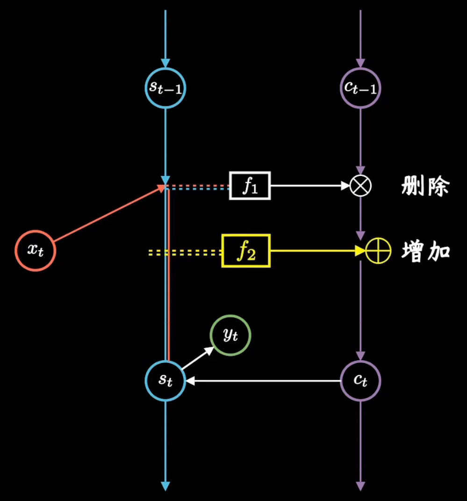

3-5 循环神经网络
----------------

1. RNN模型
~~~~~~~~~~

循环神经网络的英文是Recurrent Neural
Network，简称RNN。是一种专门为处理序列数据而生的模型，擅长理解语言背后的含义。如果说CNN是视觉卓越的工匠，RNN就是记忆力惊人的大师。
先让我们来看看它的网络结构有什么不一样。

通常的深度神经网络是这样水平延展，而他的每一种变体都具有特别的能力，比如之前讲过的CNN卷积神经网络，就是通过小巧的卷积核，提取图像特征，但它都没有考虑输入序列在时间维度上的联系。

这是因为在CNN中，每一次预测都是独立的，比如做图片分类，不存在前一张图片是猫，后一张图片一定也是猫的规律。RNN则不同，
更加细腻温情。关注隐层每个神经元在时间维度上的不断成长与进步

在RNN中，输入的是序列，它是有前后关系的。比如预测股价要参考之前一段时间的股价；预测文本要参考上下文。同一个词在不同语境下，会有不同的意义。

体现在图上，让我们变换一下3D视角，网络结构不变，但是沿时间轴Recurrent，也就是重复。同时建立时序上的关联。这里的层级扩展，并非神经元数量的增加，而表示隐层在不同时刻的状态。

根据不同问题的需要，隐层间的时序关联既可以是全连接式的，也可以局限于自己对自己。如果用\ :math:`W_s`\ 来表示层级间的权重矩阵，RNN通常会假定不同层共享一个W，增加时序信息的同时也减少了训练参数。

先看一下一般的神经网络，对隐层而言，如果输出用表示，那么

.. math:: S_i = f(\sum^{N}_{n}(w_{in}^{i}x_{n}^{i}+b_{i}))

其中f是激活函数，\ :math:`W_{in}`\ 是输入权重，i是神经元序号，简化成矩阵形式就是\ :math:`S=f(W_{in}X+b)`\ ；而对于RNN，考虑时序信息t，多了一项\ :math:`W_sS_{t-1}`\ ，公式就变成了\ :math:`S_t=f(W_{in}X+W_sS_{t-1}+b)`\ 。建立了隐层在不同时刻\ :math:`S_{t-1}`\ 和\ :math:`S_t`\ 间的迭代关系，换言之，就是让神经网络有了记忆能力。

对于图片分类，输入每张图都是独立的，前后无关
往往CNN就够了。但对于很多语言类问题，输入的语境和语序都很重要：比如，你方便吗？不方便，我正在方便。how
much? 好吃吗？ 嘛好吃？
吃嘛好？一个简单的句子，如果调换语序，可能会改变意思甚至不知所云。这时RNN就有了用武之地。

再举个例子：一天，iPhone99发售了。女朋友给你发微信，说：我手机坏了，好想要256g的苹果啊。你说：木问题，下班就买。当你憨憨的把256克苹果递到女神面前，你猜会发生啥？

当我们想让模型理解“苹果”到底指的是水果还是手机的时候，就可以使用RNN模型。因为输入序列前面提到过手机，当\ :math:`X_t=g`\ 时，由于\ :math:`S_{t-1}`\ 中包含了手机的信息，就能够推断这里面的g应该指的存储大小gigabyte而不是重量单位克。同理，输入苹果时，也能够判断出是乔老爷家的，而不是水果摊上的。

RNN就是用这样一种看似级联，本质上却是沿时序反复迭代的网络结构实现了对序列数据的学习。我们经常看到介绍RNN时，用这样一张图，虽然意思上是对的，但有些过于抽象，对初学者不友好。

它把所有输入、隐层和输出都浓缩成一个节点，然后把不同时间点上，隐藏层参数\ :math:`W_s`\ 的更新，画成了一个循环的大圈。我们把它按时间线展开，就可以看到不同时刻的信息是如何传递的。

.. image:: ../../notebook/3-5/assets/rnn-6.png

其中每一列都是一条完整的神经网络链路，不同的只是中间隐藏层之间产生了联系。\ :math:`O_t`\ 是t时刻输出的标签，它是由\ :math:`S_t`\ 决定的。\ :math:`S_t`\ 则是由\ :math:`X_t`\ 和上一时刻的\ :math:`S_{t-1}`\ 共同决定的。

我们把整张图旋转90度，从左致右，输入、隐层、输出有序排列，更接近我们对神经网络的认知，结构更加清晰。不同的是他换了个角度在时间轴上做文章，让隐藏层神经元在时间维度上的产生了联系。

RNN天生就是一个记账小能手，能够处理时序数据，这种天赋让RNN在自然语言处理领域实现了巨大飞跃。它的训练和传统神经网络一样，也采用误差反向传播+梯度下降来更新权重。只不过，序列数据共享同一个参数矩阵，相当于在计算隐层时引入了之前每一时刻的信息。

如同人的记忆难以持久一样，由于大部分情况下，梯度下降的求导结果是小于1的，小于1的数连乘会越乘越小。也就是说，说相隔越远的信息，对当前影响越小，这种时序信息不可能无限传递。为了解决这个问题，人们在RNN的基础上，提出了长短期记忆网络（Long-short-term-memory，简称LSTM）

2. LSTM模型
~~~~~~~~~~~

和RNN相比，LSTM增加了一条新的时间链，记录long-term
memory，我们用c来表示。同时，它增加了s和c两条链间的关联关系。新增加的链条c，就是用来记录信息的日记本。

那么该如何往小本本上记录信息呢？LSTM用了三个“门”结构。我们经常会在资料中看到这样一张图。看着相当热闹，但也很让人头大。

.. image:: ../../notebook/3-5/assets/rnn-9.png

这些复杂操作对应我们自己的图，就是红框部分，我们把它拆开看看里面究竟进行了哪些操作。

一条线拆成了三条线，其中包含了两步更加细致操作：删除旧日记、增添新日记。

首先，函数就像是块橡皮擦，根据昨天记忆和今天输入，决定要修改日记中哪些记录。用数学公式来表示就是

.. math:: f_1=sigmoid(w_1\left [ \begin{array}{c}x_t\\s_{t-1}\end{array}\right ] +b_1)

其中sigmoid函数取值在[0,
1]之间，矩阵元素相乘时会让元素数值越乘越小，相当于选择性遗忘了部分记忆，因此也常常被称为遗忘门。它就像一个阀门一样，过滤重要特征，忽略无关信息。

然后，函数f2就像是个铅笔，再次根据昨天记忆和今天输入，决定要在日记本上增加哪些记录，数学公式如下：

.. math:: f_2=sigmoid(w_2\left [ \begin{array}{c}x_t\\s_{t-1}\end{array}\right ] +b_2)×tanh(w_2^{'}\left [ \begin{array}{c}x_t\\s_{t-1}\end{array}\right ] +b_2^{'}) 

其中sigmoid函数再次对内容进行了选择，tanh函数取值在[-1,
1]之间，相当于并不是单纯的遗忘，而是把这两天发生事情，进行梳理和归纳，这步操作也常常被称为输入门，就是输入新日记。

先用橡皮在日记本上删减，再用铅笔在日记本上添加记录，两步操作合起来，用公式表示就是：

.. math:: c_t=f_1×c_{t-1}+f_2

对应图上就是先相乘再相加，这样就得到了新的日记。它除了会继续往下传递，同时会被用来更新当前的短期记忆，最后我们可以计算输出：

.. math:: f_2=sigmoid(w_s\left [ \begin{array}{c}x_t\\s_{t-1}\end{array}\right ] +b_s)×tanh(c_t) 

同时保持短期记忆链\ :math:`S_t`\ 和长期记忆链\ :math:`C_t`\ ，并且相互更新，这就是LSTM成功的奥秘了。

由于深入发掘了数据时序上的有趣关联，LSTM某种程度上模拟了大脑，关注重要片段而忽略无关信息，这极大的拓展了人工智能的应用。作为最成功的算法模型，LSTM与卷积神经网络CNN和反向传播一起，构成了人工智能20年多来发展最重要的三大基石。

3. RNN系列模型的应用
~~~~~~~~~~~~~~~~~~~~

由于时序上的层级结构，使得RNN在输入输出关系上具备了更大的灵活性，能够解决不同的问题。比如单入多出的形式，输入可以是一幅图片，输出是一段话或音乐，利用它就可以实现看图说话的功能。

这种N to
1的情况正好相反，序列式的输入可以是一段话，单个的输出可以是情感类别或者一张图片。

N to
N的情况下，输入和输出序列是等长的。这种RNN可以用来生成文章、诗歌，甚至代码，非常有意思。

还有一种N to
M的情况，又叫Encoder-Decoder模型，或者Seq2Seq模型，它先将输入数据编码成一个上下文向量，然后再通过它输出预测序列，这种RNN在机器翻译、文本摘要、阅读理解、对话生成等很多领域都有着极为广泛的应用。

4. RNN & LSTM代码实现
~~~~~~~~~~~~~~~~~~~~~

我们这里依然使用pytorch框架来学习RNN和LSTM模型的构建。用pytorch实现rnn非常简单，两行代码即可：

import torch

rnn = torch.nn.RNN(input_size=8, hidden_size=8, num_layers=1)

这里面需要传递三个参数，分别是input_size，输入数据的维度，在NLP任务中就等于词向量的维度；hidden_size，隐藏层的神经元个数，如果是分类任务，那么就等于类别数目；num_layers，网络的层数，默认为1。其他还可以传入bias、batch_first、dropout、bidirectional参数，这里暂不涉及，感兴趣可以自行实验。

接下来就可以输入数据获取到输出结果了：

num_layers = 1

batch_size = 1

hidden_size = 8

s = torch.randn(num_layers, batch_size, hidden_size)

out, _ = rnn(input, s)

这里面input就是输入数据，s就是隐藏层的参数，这里采用随机初始化。

对网络的输出，我们一般会通过定义损失函数，来计算出损失，然后采用梯度下降法去更新网络参数。具体代码如下：

import torch

criterion = torch.nn.CrossEntropyLoss()  # 选择交叉熵损失函数

optimizer = torch.optim.AdamW(model.parameters(), lr=0.05)  # 选择AdamW优化器

loss = criterion(outputs, labels)

loss.backward()

optimizer.step()

最后选择output的最大值作为分类的序号：

\_, idx = outputs.max(dim=1)

接下来，我们一起动手以一个N to
N的序列生成任务为例，假设输入是“我要好好学习”，希望输出是“我要乖乖躺平”，那么我们可以训练一个RNN模型。

首先引入pytorch包，并定义模型超参数：

.. code:: ipython3

    import torch
    input_size = 8      #输入维度
    hidden_size = 8     #隐藏层神经元个数
    num_layers = 1      #网络层数
    batch_size = 1      #一次性处理样本量
    seq_len = 6         #序列长度
    total = 50          #模型迭代次数

接下来输入词表，我们这两个句子，一共包含了8个字，那么词表如下：

.. code:: ipython3

    word_list = ['我', '要', '好', '学', '习', '乖', '躺', '平']

那么对于两个句子，可以表示成如下两个向量形式

.. code:: ipython3

    input_sent = [0, 1, 2, 2, 3, 4]
    output_sent = [0, 1, 5, 5, 6, 7]

其中的每一个数字代表该位置的词在词表的位置索引。词表里面的每个词，可以用one
hot 向量表示，如下:

.. code:: ipython3

    one_hot = [[1, 0, 0, 0, 0, 0, 0, 0],    #我
               [0, 1, 0, 0, 0, 0, 0, 0],    #要
               [0, 0, 1, 0, 0, 0, 0, 0],    #好
               [0, 0, 0, 1, 0, 0, 0, 0],    #学
               [0, 0, 0, 0, 1, 0, 0, 0],    #习
               [0, 0, 0, 0, 0, 1, 0, 0],    #乖
               [0, 0, 0, 0, 0, 0, 1, 0],    #躺
               [0, 0, 0, 0, 0, 0, 0, 1]]    #平

接下来为了将数据送进模型，要进行一些数据格式的转化：

.. code:: ipython3

    input_one_hot = [one_hot[x] for x in input_sent] 
    inputs = torch.Tensor(input_one_hot).view(seq_len, batch_size, input_size)
    labels = torch.LongTensor(output_sent)

然后我们自定义一个rnn模型类

.. code:: ipython3

    class Model(torch.nn.Module):
        def __init__(self, input_size, hidden_size, batch_size, num_layers=1):
            super(Model, self).__init__()
            self.batch_size = batch_size
            self.input_size = input_size
            self.hidden_size = hidden_size
            self.num_layers = num_layers
            self.rnn = torch.nn.RNN(input_size=self.input_size, hidden_size=self.hidden_size, num_layers=num_layers)
    
        def forward(self, input):  
            s = torch.randn(self.num_layers, self.batch_size, self.hidden_size)
            out, _ = self.rnn(input, s)  
            return out.view(-1, self.hidden_size) 

然后就可以训练了，运行一下可以看到输出。

.. code:: ipython3

    model = Model(input_size, hidden_size, batch_size, num_layers)
    
    criterion = torch.nn.CrossEntropyLoss()                     #选择交叉熵损失函数
    optimizer = torch.optim.AdamW(model.parameters(), lr=0.05)  #选择AdamW优化器
    for epoch in range(total):
        optimizer.zero_grad()
        outputs = model(inputs)
        loss = criterion(outputs, labels)
        loss.backward()
        optimizer.step()
    
        _, idx = outputs.max(dim=1)
        print('输入：我要好好学习 输出：', ''.join([word_list[x] for x in idx]), end='')
        print(', Epoch [%d/%d] loss = %.3f' % (epoch + 1, total, loss.item()))

.. parsed-literal::

    输入：我要好好学习 输出： 平躺躺要要要, Epoch [1/50] loss = 2.027
    输入：我要好好学习 输出： 平躺躺躺躺平, Epoch [2/50] loss = 1.858
    输入：我要好好学习 输出： 好躺乖躺躺平, Epoch [3/50] loss = 1.907
    输入：我要好好学习 输出： 我躺乖躺躺平, Epoch [4/50] loss = 1.700
    输入：我要好好学习 输出： 好躺乖乖躺平, Epoch [5/50] loss = 1.498
    输入：我要好好学习 输出： 我躺乖乖躺平, Epoch [6/50] loss = 1.517
    输入：我要好好学习 输出： 乖躺乖乖躺平, Epoch [7/50] loss = 1.572
    输入：我要好好学习 输出： 乖躺乖乖躺平, Epoch [8/50] loss = 1.427
    输入：我要好好学习 输出： 我我乖乖躺平, Epoch [9/50] loss = 1.344
    输入：我要好好学习 输出： 乖要乖乖躺平, Epoch [10/50] loss = 1.233
    输入：我要好好学习 输出： 乖要乖乖躺平, Epoch [11/50] loss = 1.432
    输入：我要好好学习 输出： 我要乖乖乖平, Epoch [12/50] loss = 1.137
    输入：我要好好学习 输出： 好要乖乖躺平, Epoch [13/50] loss = 1.154
    输入：我要好好学习 输出： 我要乖乖躺平, Epoch [14/50] loss = 1.119
    输入：我要好好学习 输出： 我要乖乖躺平, Epoch [15/50] loss = 1.115
    输入：我要好好学习 输出： 躺平乖乖躺平, Epoch [16/50] loss = 1.378
    输入：我要好好学习 输出： 我要乖乖躺平, Epoch [17/50] loss = 0.971
    输入：我要好好学习 输出： 乖要乖乖躺平, Epoch [18/50] loss = 1.064
    输入：我要好好学习 输出： 躺躺乖乖躺平, Epoch [19/50] loss = 1.381
    输入：我要好好学习 输出： 我要乖乖躺平, Epoch [20/50] loss = 1.040
    输入：我要好好学习 输出： 我要乖乖躺平, Epoch [21/50] loss = 0.983
    输入：我要好好学习 输出： 我要乖乖躺平, Epoch [22/50] loss = 0.988
    输入：我要好好学习 输出： 我要乖乖躺平, Epoch [23/50] loss = 0.880
    输入：我要好好学习 输出： 我要乖乖躺平, Epoch [24/50] loss = 0.913
    输入：我要好好学习 输出： 我要乖乖躺平, Epoch [25/50] loss = 0.907
    输入：我要好好学习 输出： 我要乖乖躺平, Epoch [26/50] loss = 0.848
    输入：我要好好学习 输出： 我要乖乖躺平, Epoch [27/50] loss = 0.876
    输入：我要好好学习 输出： 我要乖乖躺平, Epoch [28/50] loss = 0.842
    输入：我要好好学习 输出： 我要乖乖躺平, Epoch [29/50] loss = 0.918
    输入：我要好好学习 输出： 我要乖乖躺平, Epoch [30/50] loss = 0.802
    输入：我要好好学习 输出： 我要乖乖躺平, Epoch [31/50] loss = 0.905
    输入：我要好好学习 输出： 我要乖乖躺平, Epoch [32/50] loss = 0.801
    输入：我要好好学习 输出： 我要乖乖躺平, Epoch [33/50] loss = 0.769
    输入：我要好好学习 输出： 我要乖乖躺平, Epoch [34/50] loss = 0.791
    输入：我要好好学习 输出： 我要乖乖躺平, Epoch [35/50] loss = 0.763
    输入：我要好好学习 输出： 我要乖乖躺平, Epoch [36/50] loss = 0.768
    输入：我要好好学习 输出： 我要乖乖躺平, Epoch [37/50] loss = 0.815
    输入：我要好好学习 输出： 我要乖乖躺平, Epoch [38/50] loss = 0.785
    输入：我要好好学习 输出： 乖要乖乖躺平, Epoch [39/50] loss = 0.830
    输入：我要好好学习 输出： 我要乖乖躺平, Epoch [40/50] loss = 0.760
    输入：我要好好学习 输出： 我要乖乖躺平, Epoch [41/50] loss = 0.732
    输入：我要好好学习 输出： 我要乖乖躺平, Epoch [42/50] loss = 0.732
    输入：我要好好学习 输出： 乖要乖乖躺平, Epoch [43/50] loss = 1.005
    输入：我要好好学习 输出： 我要乖乖躺平, Epoch [44/50] loss = 0.740
    输入：我要好好学习 输出： 我要乖乖躺平, Epoch [45/50] loss = 0.720
    输入：我要好好学习 输出： 我要乖乖躺平, Epoch [46/50] loss = 0.771
    输入：我要好好学习 输出： 我要乖乖躺平, Epoch [47/50] loss = 0.770
    输入：我要好好学习 输出： 我要乖乖躺平, Epoch [48/50] loss = 0.749
    输入：我要好好学习 输出： 我要乖乖躺平, Epoch [49/50] loss = 0.756
    输入：我要好好学习 输出： 我要乖乖躺平, Epoch [50/50] loss = 0.726
    

如此就实现了一个最简单的RNN模型。
那么如果想用LSTM模型又该怎么办呢？很简单，只要调整一下模型类即可，将RNN改为LSTM模型。

.. code:: ipython3

    class Model(torch.nn.Module):
        def __init__(self, input_size, hidden_size, batch_size, num_layers=1):
            super(Model, self).__init__()
            self.batch_size = batch_size
            self.input_size = input_size
            self.hidden_size = hidden_size
            self.num_layers = num_layers
            self.lstm = torch.nn.LSTM(input_size=self.input_size, hidden_size=self.hidden_size, num_layers=num_layers)
    
        def forward(self, input):  
            s = torch.randn(num_layers, batch_size, hidden_size)
            c = torch.randn(num_layers, batch_size, hidden_size)
            out, _ = self.lstm(input, (s, c)) 
            return out.view(-1, self.hidden_size)  

可以看到在forward方法里面，除了s外，我们又初始化了一个c，这就是所谓LSTM的日记本。

其他代码不变，再次运行一下，可以看到结果。

.. code:: ipython3

    model = Model(input_size, hidden_size, batch_size, num_layers)
    
    criterion = torch.nn.CrossEntropyLoss()                     #选择交叉熵损失函数
    optimizer = torch.optim.AdamW(model.parameters(), lr=0.05)  #选择AdamW优化器
    for epoch in range(total):
        optimizer.zero_grad()
        outputs = model(inputs)
        loss = criterion(outputs, labels)
        loss.backward()
        optimizer.step()
    
        _, idx = outputs.max(dim=1)
        print('输入：我要好好学习 输出：', ''.join([word_list[x] for x in idx]), end='')
        print(', Epoch [%d/%d] loss = %.3f' % (epoch + 1, total, loss.item()))

.. parsed-literal::

    输入：我要好好学习 输出： 好好好平学学, Epoch [1/50] loss = 2.160
    输入：我要好好学习 输出： 乖习平平平平, Epoch [2/50] loss = 2.061
    输入：我要好好学习 输出： 乖乖平平平平, Epoch [3/50] loss = 2.037
    输入：我要好好学习 输出： 要要平平平平, Epoch [4/50] loss = 1.946
    输入：我要好好学习 输出： 乖乖乖乖平平, Epoch [5/50] loss = 1.935
    输入：我要好好学习 输出： 躺躺躺躺平平, Epoch [6/50] loss = 1.924
    输入：我要好好学习 输出： 习平平平平平, Epoch [7/50] loss = 1.947
    输入：我要好好学习 输出： 平乖乖乖平平, Epoch [8/50] loss = 1.888
    输入：我要好好学习 输出： 平平乖乖平平, Epoch [9/50] loss = 1.779
    输入：我要好好学习 输出： 我乖乖乖平平, Epoch [10/50] loss = 1.653
    输入：我要好好学习 输出： 乖乖乖乖乖平, Epoch [11/50] loss = 1.619
    输入：我要好好学习 输出： 平平平乖平平, Epoch [12/50] loss = 1.724
    输入：我要好好学习 输出： 我要躺乖平平, Epoch [13/50] loss = 1.624
    输入：我要好好学习 输出： 我要乖乖乖平, Epoch [14/50] loss = 1.505
    输入：我要好好学习 输出： 我乖乖乖乖平, Epoch [15/50] loss = 1.522
    输入：我要好好学习 输出： 要要乖乖乖乖, Epoch [16/50] loss = 1.511
    输入：我要好好学习 输出： 学要乖乖乖乖, Epoch [17/50] loss = 1.526
    输入：我要好好学习 输出： 平平乖乖乖平, Epoch [18/50] loss = 1.539
    输入：我要好好学习 输出： 学乖乖乖乖乖, Epoch [19/50] loss = 1.477
    输入：我要好好学习 输出： 平乖乖乖乖平, Epoch [20/50] loss = 1.457
    输入：我要好好学习 输出： 乖乖乖乖乖平, Epoch [21/50] loss = 1.314
    输入：我要好好学习 输出： 乖要乖乖乖平, Epoch [22/50] loss = 1.401
    输入：我要好好学习 输出： 要要乖乖躺平, Epoch [23/50] loss = 1.249
    输入：我要好好学习 输出： 乖乖乖乖躺平, Epoch [24/50] loss = 1.296
    输入：我要好好学习 输出： 躺要乖乖躺平, Epoch [25/50] loss = 1.278
    输入：我要好好学习 输出： 要要乖乖躺平, Epoch [26/50] loss = 1.251
    输入：我要好好学习 输出： 要要乖乖躺平, Epoch [27/50] loss = 1.227
    输入：我要好好学习 输出： 平要乖乖躺平, Epoch [28/50] loss = 1.375
    输入：我要好好学习 输出： 要要乖乖躺平, Epoch [29/50] loss = 1.193
    输入：我要好好学习 输出： 乖要乖乖躺平, Epoch [30/50] loss = 1.258
    输入：我要好好学习 输出： 乖要乖乖躺平, Epoch [31/50] loss = 1.211
    输入：我要好好学习 输出： 平要乖乖躺平, Epoch [32/50] loss = 1.272
    输入：我要好好学习 输出： 我要乖乖躺平, Epoch [33/50] loss = 1.191
    输入：我要好好学习 输出： 要要乖乖躺平, Epoch [34/50] loss = 1.246
    输入：我要好好学习 输出： 我要乖乖躺平, Epoch [35/50] loss = 1.169
    输入：我要好好学习 输出： 要要乖乖躺平, Epoch [36/50] loss = 1.165
    输入：我要好好学习 输出： 要要乖乖躺平, Epoch [37/50] loss = 1.130
    输入：我要好好学习 输出： 乖要乖乖躺平, Epoch [38/50] loss = 1.083
    输入：我要好好学习 输出： 我要乖乖躺平, Epoch [39/50] loss = 1.029
    输入：我要好好学习 输出： 我要乖乖躺平, Epoch [40/50] loss = 1.059
    输入：我要好好学习 输出： 我要乖乖躺平, Epoch [41/50] loss = 1.108
    输入：我要好好学习 输出： 要要乖乖躺平, Epoch [42/50] loss = 1.075
    输入：我要好好学习 输出： 我要乖乖躺平, Epoch [43/50] loss = 1.017
    输入：我要好好学习 输出： 我要乖乖躺平, Epoch [44/50] loss = 1.071
    输入：我要好好学习 输出： 我要乖乖躺平, Epoch [45/50] loss = 1.043
    输入：我要好好学习 输出： 乖要乖乖躺平, Epoch [46/50] loss = 1.067
    输入：我要好好学习 输出： 我要乖乖躺平, Epoch [47/50] loss = 0.985
    输入：我要好好学习 输出： 我要乖乖躺平, Epoch [48/50] loss = 1.008
    输入：我要好好学习 输出： 乖要乖乖躺平, Epoch [49/50] loss = 1.063
    输入：我要好好学习 输出： 我要乖乖躺平, Epoch [50/50] loss = 0.980
    

至此，你已经成功使用LSTM模型实现了N to
N的序列生成任务，虽然数据只有一条。

CNN和RNN分别从时间和空间上对数据进行学习，让神经网络变得更加强大。我们说CNN视力佳，RNN记性好，那么有没有一种模型能够兼具二者的优势呢？

敬请期待我们下期内容——强大的变形金刚Transformer。 我们下期不见不散。
